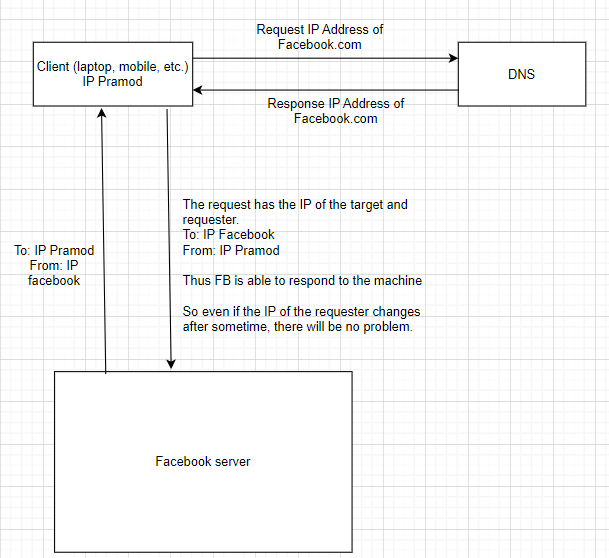

# What is High Level Design?

Designing system at scale is high-level designing.
What kind of architectural decision we need to make to create:
* Distributed System
* System Architecture
* Scalable System

## delic.io.us
* Solve the problem of create a bookmark in 2000s.
* Create an account, login and create bookmark.
* Apis:
    * addBookmark()
    * viewBookmarks()

Internet-Network of networks

**IP Address**—Address of the computer connected to the internet.
* Public IP Address-When connecting to the internet, we need a public IP address to be identified on the network. 
* Private IP Address-Used in intranet

* Static IP address-IP address that does not change (ex.facebook.com, google.com)
* Dynamic IP address-IP changes with network we connect to.

**MAC Address vs. IP Address:**

**MAC Address**—address given to the hardware. (biometrics)

**IP Address**—address given to the machine connected to the internet. IP address which change based on the network we connect our device to. (House address)

### we communicate with servers?

DNS is required to convert the domain name to the IP address. The client connects to DNS and gets the IP address of facebook.com and then request to that IP Address.

## Domain Name System
Looks like a hashmap for domain name to IP address.

**How will client reach to DNS?**

Internet service providers as part of configurations provide address of DNS.

Problems-In reality, DNS needs to handle requests at the internet scale
1. **scale** - Amount of traffic that will come
2. **latency** - amount of time for transmission of the packets from machine to router, router to DNS, DNS to machine, machine to facebook server via optical cables under the sea. (latency is proportional to distance). If fb server is in US and client in India latency will be high.

We have DNS servers as hierarchy.
* Top Level Domain-For every domain we have different TLD server (.com, .us, .org)
* For every TLD we have secondary level servers which are again branched out have multiple levels.
* These are at different geographical locations

1. DNS is a distributed system has shared data.
2. We have some caching involved to avoid going to root level server for every request. Like caching at our own end.

Browser has a cache; OS also has a cache, Router also has a cache, also, neighborhood DNS machine also has cache.

The Majority of the DNS requests are resolved internally at our home or even by the neighborhood DNS machine.

### How delicious was started?
1. Written code on local machine
2. Public static IP address
3. Bought a domain name - delic.io.us
4. DNS mapping for IP and domain name

ICANN Is the central authority of all the domain names in the world. Direct-i or GoDaddy but from ICANN in bulk and sell them.

### Who owns DNS servers?
The internet service providers own DNS servers to provide faster internet. Google also owns DNS server since it operates on such large scale.

### DNS Spoofing
If a user is connected to fake DNS then we might be we directed to incorrect sight and share our details there, which is very risky.

### How DNS works?
Here's a detailed step-by-step explanation of how DNS works:
1. `User Input`: We start by typing a URL (Uniform Resource Locator) into the web browser, such as "www.example.com"
2. `Local DNS Cache Lookup`: Before making a request to a DNS server, the device checks its local DNS cache to see if it has previously looked up the IP address for the given domain. If the IP address is found in the cache and is still valid (not expired), the device can use it directly without further queries. This cache helps to speed up the process and reduce the load on DNS servers.
3. `Local OS-Level DNS Cache Lookup`: If our device has not found the information in its local cache, it may also check the operating system's DNS cache. This cache is maintained by the operating system and acts as an additional layer of caching to speed up DNS resolution. If the IP address is found and still valid in the OS-level cache, the device can use it without further queries.
4. `Recursive DNS Server`: If the IP address is not found in the local cache or has expired, thr device contacts a recursive DNS server, also known as a resolver. This resolver is usually provided by the Internet Service Provider (ISP) or a public DNS service like Google DNS (8.8.8.8) or Cloudflare (1.1.1.1).
5. `Root DNS Servers`: If the recursive DNS server doesn't have the IP address information, it starts the resolution process by querying the root DNS servers. These root servers maintain information about the top-level domains like ".com", ".org", ".net", etc. There are only a few hundred of these servers worldwide, operated by different organizations.
6. `TLD (Top-Level Domain) DNS Servers`: The root DNS server responds with a referral to the appropriate Top-Level Domain (TLD) DNS server for the requested domain. In our example, it would be the TLD server for ".com"
7. `Authoritative DNS Servers`: The TLD server then refers the recursive DNS server to the authoritative DNS server for the specific domain, in this case, "example.com". The authoritative DNS server is responsible for storing and providing the accurate IP address information for the domain.
8. `DNS Query to Authoritative Server`: The recursive DNS server sends a DNS query to the authoritative DNS server for "example.com", asking for the IP address associated with "www.example.com".
9. `Response from Authoritative Server`: The authoritative DNS server responds with the requested IP address for "www.example.com" to the recursive DNS server.
10. `Response to User`: The recursive DNS server now has the IP address and sends it back to our device.
11. `Browser Initiates Connection`: Armed with the IP address, your browser initiates a connection to the web server at that IP address.
12. `Web Server Response`: The web server receives the connection request and sends back the requested web page's data to the browser.
13. `Rendering the Web Page`: Your browser processes the data received from the web server and renders the web page, displaying it for us to see and interact with.

### Issues with delic.io.us
Too many people using the system can cause following issue:
* CPU bottleneck—To handle high requests number
* Hard disk bottleneck - Space issue, limited storage on laptop high user data
* RAM bottleneck
* Network card bottleneck - NIC would not support high bandwidth for too many requests.

We have a Single Point of Failure for delic.io.us

### How to handle a scale problem?
* **Horizontal Scaling** - If a machine is not able to handle the requests, then instead of buying bulkier machine add more small/cheap machines (commodity hardware) to the cluster.
    * Cheaper—commodity pieces of hardware are economical compared to powerful machines
    * Allows for flexibility—We can turn on and off the machines as per the flow of traffic
    * Horizontal scaling becomes tougher as you have to navigate the challenges of machines talking to each other over network.
    * SPOF is solved
* **Vertical Scaling** - Simple idea of buying a new machine every time we face issue, machine with better configurations more RAM etc.
    * Cost Implication - Powerful machines are costlier
    * Estimation - scale flexibility is lost cause we cannot scale down or up based on requirements
    * SPOF is still not resolved

