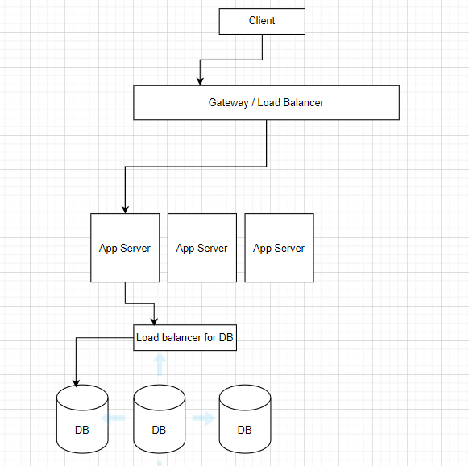
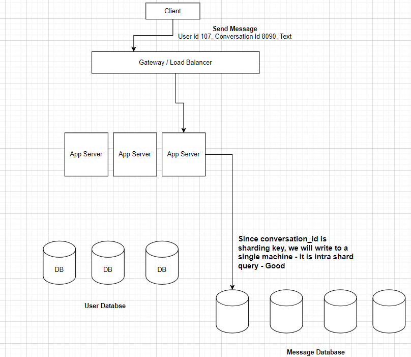
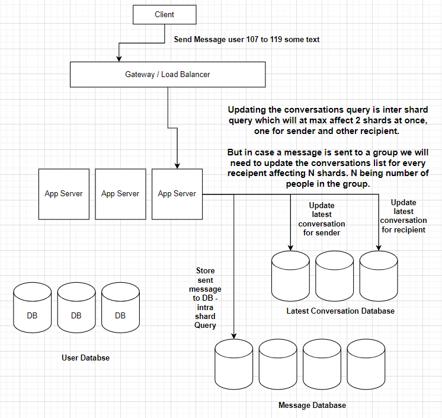

# Design a Messenger

Systems to be discussed - messenger, slack, MS Teams but not WhatsApp

### 1. Features / Minimum Viable Product (MVP)

* Send a message / Receive a message
* 1:1 messaging
* Group messaging
* Chat history
* Conversation where messages are part of

> Assumed set of features
> 
> * User registration
> * Authenticate/ Authorize
> * Search-popular features
> * Notification to user

> Not so important features
> * Sent receipt
> * Read receipt
> * Status of user - online/offline, typing/not typing
> * Last seen

### 2. Estimation of Scale

* Total users on facebook ~ 2 billion
* Total Daily active uses ~ 400 million
* Avg messages / user / day ~ 50 messages
* No. of messages sent / day ~ 400M * 50 = 20 Billion
* Write Query per seconds ~ 20B/ 86400
* Read Query per seconds ~ 4 * Write QPS

> Sending a message is write operation and reading a message is read operation also 4 times cause we can read n number of times once the message is sent.

> **Indicate Read + Write Heavy System**

**What might a message contain?**
* Message content - avg. 70B
* User - sender_id, receiver_id (8B each)
* timestamp (8B each)
* message_id (8B each)
* media content reference id (10B)
* status of the messages (edited or not, read or not, delivered or not) - (8B in total for all)
* **Total - 200B (approx)**

* 20 Billion msg/day * 200 Byte = ~ 4000GB = 4TB msgs / day (Billion * Byte = GB)
* 4TB * 365 days * 10 years = 12PB (12000 TB)

> **To store this huge data Sharding is a must.**

> WhatsApp
> 
> WhatApp is just a client, it stores the messages on the client machines thus saves 20 billion dollars.

### 3. Design Goals

1. Latency - Reasonable low (PACELC)
2. Consistency - Highly consistent (System should not say your msg is ent and after 10 mins failed to send your message, hence we need highly consistent system) If I am told a message is sent, it should be sent and delivered to the receiver.
3. Availability - Will be compromised (PAC)

### 4. Design Deepdive

#### **1. API Design**

1. `sendMessage(sender_id, conversation_id, text)` - conversation id given flexibility to be sent to both individual and a group

> Idempotence
> 
> There has to be way so that server identifies if client is trying to send the same message again or this is a new message and needs to be processed.
> 
> To have this usually client generates a unique identifier for each message called message_id. The server checks if it has processed the provided message_id in request, if yes then it knows its retry request

2. `getConversations(user_id, offset, limit)` - get all conversation going on for me, pagination needs offset, limit
3. `getMessages(user_is, conversation_id, offset, limit)` - get messages of particular conversation, again need pagination cause can't load all the messages at once.

> user_id in all the request can be replaced with authentication token

Sending message 1:1 flow:

Once the message is sent, it needs to be written/ stored in database. On basis of what we decide on which machine to store it (what should be our shard key)?

Also, once a message is sent, the receiver needs to be notified that there is a new message - if user is online or engaged with the application then also and even if he's offline then as well maybe through an email or etc.

### What will be our sharding key?
Conversation Id - both 1:1 conversations and group conversation

### What all collections will we be having?
* User Collection - user_id, userName and other details (status and all)
* Conversation Collection - conversation_id, is 1:1 or group, member_ids (user_id)
* Messages Collection - message_id, conversation_id, metadata, timestamp, sender_id, content, image_reference_id

>User Collection is completely independent of conversation and messages meaning we can have a separate federated database for it.
>
> User has fixed schema we can use SQL
> 
> Sharding key will be user_id

>Conversation and messages collection will be in same database.
> 
> conversation_id for message DB
> 
> A conversation and its respective messages will be stored in the same shard to avoid going to different shards to collect the data.
> 
> If we think we will need to make calls to user DB again and again, we can cache the most active users in global cache to avoid that latency.

Similarly, get a message for a conversation is also an intra-shard query

But get Conversations by user_id will be all shard query cause - data for a user for all the conversations may be on different machines.

> Instead of having an all shard query we have a separate federated database to maintain the latest conversations
> 
> So every send notification action will affect/update this DB as we will need to re-arrange the conversations in the list.
> We will need to update the latest conversation for both sender and recipient.

All the updates to the latest conversation database will be asynchronous or batched, meaning there can be some inconsistency in the list. 
And this will be done by maybe posting some event in a messaging queue.

All the databases will be master-slave configurations, and all will be sharded and have their own load balancer.

We need our clients to receive the messages throughout the time they are online, not just via notification i.e., via email or sms or etc. like daily digest for unread messages.

### How the messenger clients remain connected to the server to receive messages?
**1. Web-Socket Connection**

Web socket is a duplex (2-way connection) between a client and server. It is persistent meaning that a client can send a message whenever it wants and a server can also send a message whenever it wants without the need to create a new connection every time.

If we have web-socket connections between the server and client implies that our app server layer will be stateful. An app server will maintain its connection with the client when client is online.

Drawback—Web socket connections have very high-resource consumption.

**2. Http Long polling**

Long polling is a technique used in real-time communication to achieve near-instantaneous message delivery between clients and servers.

Short polling—The client sends a request to the server, which responds with the requested data. It can create delays in communication as the client has to send requests to check for updates repeatedly.

Long polling improves efficiency by keeping the request open for an extended period until new data is available. The server holds the request open and waits until it has new information to send back to the client. Once the server has new data, it responds to the client, which can then process the data and initiate a new long polling request.

* The client initiates a request to the server, typically through an HTTP request.
* Instead of immediately responding, the server holds the request open, keeping the connection active.
* If no new data is available, the server waits until it has something to send back.
* Once the server has new data or a predefined timeout occurs, it responds to the client with the latest information.
* Upon receiving the response, the client immediately sends another request to the server to maintain the connection.
* This cycle of sending requests and receiving responses continues, ensuring real-time updates.

### How are the receipts for messages delivered or read maintained?
These are basically simple meta-data features which can be treated as a message.

The server can send these updates to the clients via new messages and client UI is updated accordingly.

### How to handle cases where client/user is offline?
There is no long poll request pending on server, so we cannot send the notifications like this.

In this case, we can push some kind of requests in a queue. 
There will be a set of machines that will consume such a type of request and in some periodicity will send push notifications to the user.
Such applications pay to IOS, Android or third-party(clever tap) applications to send the push notifications to user.

### What caches are required here?
Caching will help with read traffic, since our system is both read and write heavy.

* **Client side cache** - to store the messages of the frequent conversations plus the images/profile photos of the frequent contacts.
* **Global Cache** - Who are the popular users and their usernames, Which are most active conversations, Most popular messages.
* **App server Cache** - Since app servers are stateful, we would want to store a user's image, latest conversations, recent messages. This will reduce the requirement to goto database every time.

### What database do you want to use?
* User database - SQL
* Messages database - messages can be of different sizes, does not make sense to use SQL. Use No-SQL which is more like SQL i.e., column store(wide-column) Cassandra or HBase. If we need high number of writes with consistency, then use HBase. If we have more availability requirement, use Cassandra.
* Latest Conversation database - Cassandra or HBase

### What caching strategy will we use?
We want consistency to be preferred write-through.
