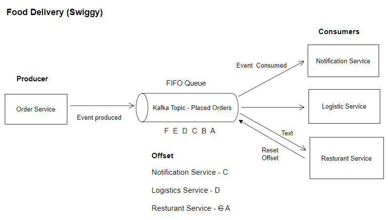
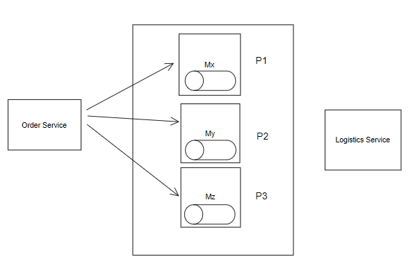
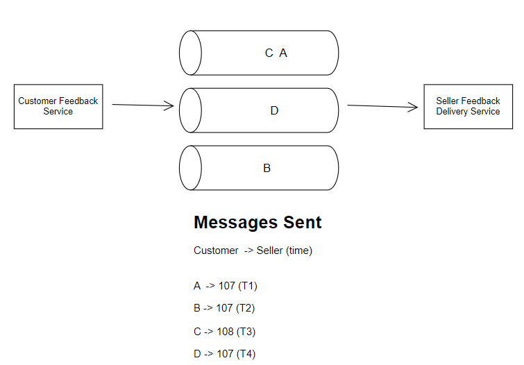
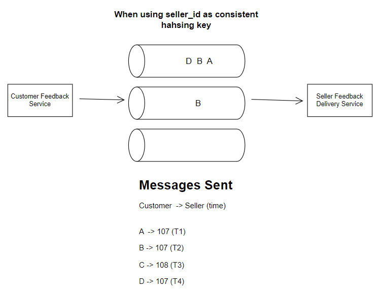
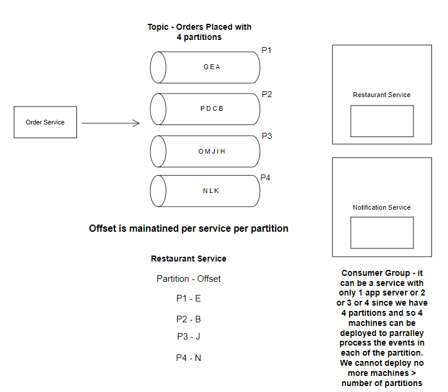

# Kafka

## Request Response Model and need for Persistent Queues
Request-Response model is usually a sync model. We wait for response from the server once we make a request.
Now suppose if we made a request to send 1000 mails does it make sense to wait for all the 1000 mails to be sent?
In usual scenario no, it is simply a waste of our time. 

In scenarios where we don't need to wait/block ourselves for a task, then async/non-bocking tasks come into the picture. 

Now suppose we have a system where we want to send a huge number of messages/notifications/email, the mail server will have some capacity and rate at which it can send the requests.
In this way a lot of other users/services who want to send notification will be blocked. Instead of blocking we can have a `Request Queue`
where we can put our request and the mail server can pick the requests one by one and process them at its own pace.
Thus, not blocking any service/user against any request and also not overloading the mail service as well.

We have also seen in cases like slack when we don't see or read our messages we get a digest mail at the end of day. These are sent based on the messages aggregated throughout the day. 

Service A generates requests at 100/min whereas the service B which processes the requests can process only 20 requests/min.

1. Processing takes lot of time, lets introduce a queue.
2. Rate of consumption is not same as rate of production.
3. If we want to do aggregation in between or throughout the day and then sending email/notification at the end of the day.

Async tasks are handled by persistent queues, publish-subscribe, pub-sub, message queues.
ex. Kafka, RabitMQ

## Kafka

Principles of kafka:
1. It is distributed meaning it can be scaled horizontally. Handle upto 10 million messages/second.
2. It is a persisted queue. The messages are persisted, are written to the disk.
3. It is Realtime meaning read throughput, and latency is less.

Suppose a system like Flipkart, we have users who are sending complaint emails. We have a complaint Management system mwho received the user emails
does some processing and sends the complaints to the sellers.

The rate at which the system receives the emails varies throughout the day.
Users write to the complaints (requests) to the queue, this event is called publishing. 
And reading from the queue is called subscribing.
Publishing means writing and reading is called Subscribing 

Publisher, Consumer are the entities writing and reading from the persisted queue.

`Kafka Queue`
When we say Kafka queue or message queue it is a collection of machines or cluster of machines and hence distributed.

Suppose there are two queues:
1. order queue - If a customer creates an order then queue in order queue.
2. Refunds queue - If a customer requests a refund then queue it in refund queue.

There are two services:
1. logistics service - wants to know about orders in queue
2. payment service - wants to know about refunds in the queue
3. seller service - wants to know about orders
4. Analytic service - wants to know about orders

Which all services need to know about a new order created?
Logistics, seller and analytic

Should a message be read by each service multiple times? 
No, a message should be read by each service exactly once, and none of the services should miss it.

Each service reads a message or order 107, only once and each service should read/consume the message, it should  not happen that if one service reads it other can skip it. 

> Kafka topics
> 
> Individual queue name inside a cluster is called kafka topic.

## Reading from the queue:
Let's say we have kafka cluster and it has two topics.

Each message written to the queue has a message_id. In a FIFO manner the messages are written in the queue.

There are services who would want to receive updates from this queue, such services register themselves to the queue.
Now Kafka uses a state manager system like Zookeeper to keep track of the last read message for each service.
Once a service reads a message, kafka updates the offset of the last read message.

The messages are not deleted after it is read by one service; this implies that the queue size will keep on growing.
To stop that, we have a TTL on every message, which means the message is deleted after TTL is crossed.

Now suppose a service realizes that it has not processed some messages lets say messages from the last 5 hours are not processed properly, 
in such a case that service can come to kafka and revise the offset.

What are all details stored in the messages?
We usually have message_id. All the details required to process the notification.
Or just a reference ids to process the notification, the services consuming the message can then make a call to database to retrieve the information.

Ideally, the messages should be lightweight.

For an order queue example:
* order_id, timestamp, user_id, params required to make an api call

Summary:
* Kafka topics are FIFO queue.
* When any producer writes a msg to a topic - creates a new msg_id which gets stored hard disk.
* A consumer can register to topic - analytic service can register to order topic (Registered consumers)
* Kafka in itself maintains information/offset of a message that a service read the last time. This means messages are not deleted once it is read by one service. 
But the queue size will keep on increasing if any service reads messages very slow, to help with this we have TTL assigned to the messages. This gives enough time to dev ops team to fix the issue with kafka before msg are lost. 
* Msg TTL are independent offsets.
* Every time a msg is delivered to a service / registered consumer, then its offset is incremented. Now in case a service / consumer is unable to receive a few msgs then it can go and reset its offset.

> Fire and Forget
> 
> Once a msg is queued by kafka, there is no response from kafka to producer.
> 
> In case we have such a requirement where producer needs to be notified, then consumer can send API request to the producer 
> or we can have a different message queue for acknowledgement.

Many services can read messages from a topic at a time. But one service cannot read multiple msg since kafka needs to maintain offset.

### What are the problems with the above solution?

1. We cannot grow our queue beyond a point—since we are using FIFO queues, we are storing these messages on single machine.
2. Given for a consumer we are reading from the end of queue, we cannot increase the speed of consumption. We cannot consume messages in parallel. We are also maintaining the offset which wil be needed to updated.

### Partition in Kafka

> Given that we want to build Kafka as a dependable / fault-tolerant system, the fundamental concept of replication should be employed.

There may be a situation that one entire machine may not be sufficient to store all messages of 1 queue also.
The usual way to solve this is sharding.

But we can't use sharding directly before understand it...

> Problem
> 
> When we divide a queue across multiple machines, it no longer remains one queue, it becomes multiple pieces if 1 queue

Suppose we have multiple machines Mx, My and Mz. Let's say the topic-placed orders is sharded across these machines.

Now producer will feed the event to a topic which will be queued in any of these machines either based on Round Robin or consistent hashing.
The consumers will have to go to every machine and ask what is their last timestamp and then compare and fetch the relevant one. 
This seems highly unoptimized, since comparing will take a lot of time plus we'll block other consumers saying I am still figuring out my latest message.

> The Kafka Topic when partitioned, no longer gives FIFO guarantees across all partitions.
> 
> Only for messages of the same partition we can have FIFO guarantees.

Order within the same partition is NOT lost, but global order is lost.

Since we are using consistent hashing to distribute events across partitions in kafka, why not make seller_id as the key for consistent hashing?

All the messages to one seller will always be placed in one partition hence maintaining the order. 
Even if multiple sellers are assigned to same partition the order per seller is still maintained.

In case we have multiple consumer services, then these services need to agree upon the ordering within partition provided by the consistent hashing Key. We can have only one key here.
In case these services cannot agree upon a key then we can have a separate copy of queue.

**Multiple consumers in scalable systems**

If one service is not able to consume the messgaes at a pace or its throughput is low then we can add more app servers to increase the throughput.
