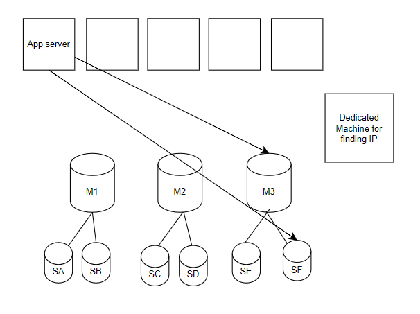

# Zookeeper

Zookeeper is a distributed configuration management system, coordination system.

Helps us keep track of dynamic systems, in master slave systems master can crash and some other system may take its place or new machines could be added or removed at any point of time; zookeeper helps us to keep track of these dynamic systems. 

Knowing IP address of shards, machines, or server or want to know which machine is master/slave. It also helps us with distributed locking on resources when we have multiple threads.
Service discovery is also a possible use case of zookeeper. It is some sort of orchestrator.

Service discovery meaning one service requires communicating to another server then with help from zookeeper it can find where it needs to reach out the required service. 

## How to build the system like zookeeper?

**Naive Solution**

App server needs to know the IP address of the Master machine for database.

The most simple thing that comes to our minds is that there should be a `dedicated machine` who maintains the IP of all the machines. 
This dedicated machine is responsible for collecting heartbeats from each of the machines and keeping track of which machines are masters and which are slaves. 

App server will then go to this dedicated machine and ask for the IP and then connect with the required machine using the IP it previously received.



Problems:
1. Single point of failure for dedicated machine
2. Additional hop in every request, meaning there is added latency

How to solve:
1. SPOF - replication
2. Additional hop - caching

## How Zookeeper works?

Zookeeper is exactly like a file system.
We have root folder, first level folder, second level folders and so on.

For every cluster/ service, we would want to have different folder.

Zookeeper stores the configurations of services as shown below:
```
ROOT:
    - SERVICE A: Payment service
        - App server Layer
        - Payment DB
            - aws_key (certificate/ key for accessing db)
            - sharding_config (file that keeps track of how many shards there are)
            - shard 1
            - shard 2
                - master_ip (file)
                - master_port (file)
                - slaveA_ip (file)
                - slaveA_port (file)
                - slaveB_ip (file)
                - slaveB_port (file)
        - Global Cache
    - SERVICE B: Order Service
    - SERVICE C: Notification Service
```

Each of the services is a first level folder with different layers within it being second layer and then finally the last or at leaf is the config file which maintains the actual details i.e., ip, port etc. 

> Why do we have this complex folder structure of such simple details stored?
> 
> We could have stored these details in a simple xml file as well. However, a file system like structure is chosen 
> since it allows us to have ultimate independent files, which would allow us to obtain locks on these individual files.
> 
> Suppose once a master dies, there will be multiple machines that will want to become master and hence a rance condition to obtain the lock over this file. 
> We want to have consistent data inside these files, these cannot be changed randomly, and hence a lock is required.

Zookeeper calls each of these files in hierarchy a `Zookeeper node`.
There are two types of zookeeper nodes:
1. `Persistent Nodes` - Persistent Files that store data which is not likely to change, rarely changes
2. `Ephemeral Nodes` - Temporary Files are the files that store data which changes often, like master_ip will change when master crashes ans so does slave_ip files. Nodes which have to live only till their underlying owner machine is active.

Suppose we have Notification service which has database with multiple shards.

`/Notification Service/Database/Shard37/master_ip` will have master machine IP, as soon as master machine dies this file also needs to be deleted.

These files live as long as the underlying entity lives are called Ephemeral Nodes.

### Collecting Heartbeats

Suppose shard37 has a master (IP: A), slave1 (IP: B), slave2 (IP: C), slave3 (IP: D).

Each of these machines will have their files which would maintain their IP.
All these machines will also send a heartbeat to the Zookeeper to tell that I am alive and healthy.
Since Zookeeper is receiving messages from these machines, it is keeping them sacrosanct, no one can tamper these files.

Now if the master dies, zookeeper will not receive the heatbeat from it.
After certain missed heartbeats zookeeper destroys the master_ip file.

### Zookeeper Watch

Zookeeper watch allows people to create a watch on another file.

Example all the slaves would set a watch on master file, in case the master file changes all the slaves need to be updated. 
Also App server and load balancer would keep a watch on master file, to know that IP of master.

In a case where master dies or crashes the zookeeper would intimate all the app servers and salves that the master that you were watching has now crashed.
All the machines now do not have to go to zookeeper everytime, these machines can once get th IP of master and continue using it until zookeeper informs them that IP has changes for master.

Once all the salves are informed that master has crashed, then there is a race condition and all the slaves race to get lock of this master file to become the master of the shard.
Zookeeper just notifies the salves to initiate master election but does not actually participate in it.

### How Zookeeper protect itself from becoming a single point of failure?

Zookeeper internally itself is a cluster, meaning it has a zookeeper master nodes and zookeeper slave nodes. 

Zookeeper cluster is usually made up of odd number of machines (5, 7, 9, 11 machines).

It has odd number of machines to achieve quorum i.e. writes is successful on more than half of machines once before the write operation is declared successful.
Master sends write request to slaves and waits for success reply from more than half of slaves.

Irony is that to manage master slave configuration in systems we need zookeeper but zookeeper within itself has master slave architecture.
In case the zookeeper master dies all the communications via zookeeper will stop, there is a separate algorithm for zookeeper master election and all the slaves will fight with each other to become the master.
The slaves use the gossip protocol to communicate with each other. 