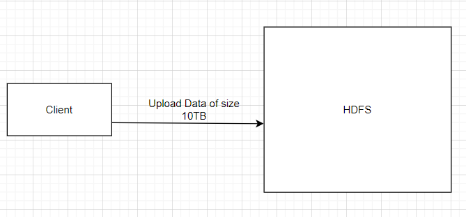
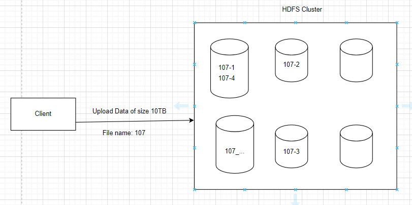
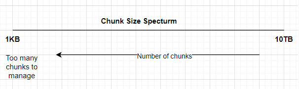
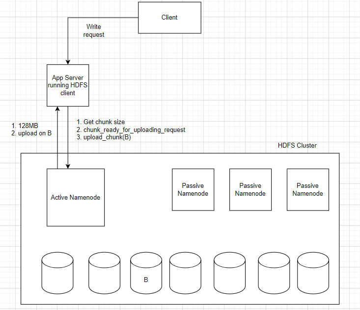
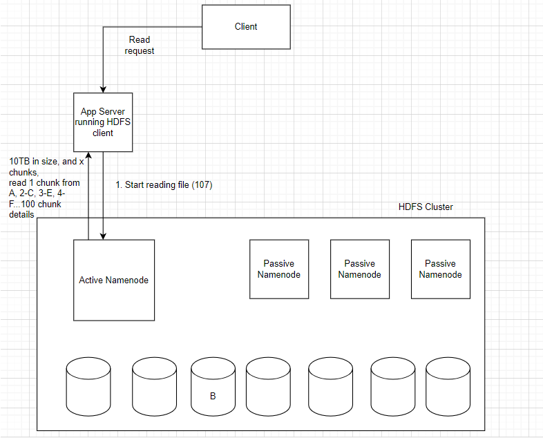

# HDFS and AWS S3

## HDFS vs CDN
Suppose we have a platform that generates a lot of videos for education, ads etc.
All of these will need to be stored at some place, we can use self-hosted kind on own machines of service like HDFS or 
the data can be pushed to cloud on a service like AWS S3.
We will not store these files on databases like SQL.

CDN is going to be used if we want our data to be available to our consumers quickly,
for example, to deliver this video to the watchers we can have a contract with AWS CDN.
We can then request CDN to store these data on edge machines in a region so the data is quickly
delivered to the watcher.

CDN is for better serving of resource to the user, whereas the S3 is for an organization to maintain the data their end.

Let's say we want to store files where essentially each file is 5GB,
and we have 100k files which will be around 100TB of data.
This 100TB of data is just the baseline we will have additional replicas of these data.
A single machine can hold around 4TB of data; hence it is evident we need a cluster of machines to handle these data.

What can we achieve with such systems?
* Huge data storage capability
* Data durability - data should never be lost
* Data uploading should not require us to restart from zero once the network fails temporarily. Intermediate state should be preserved.
* Downloading should not require to restart from zero after a failure

## Uploading data

`Trying to upload huge size files`

Problems:
* 1 File might be too big to save in a one machine
* Problem of fragmentation—Suppose each machine in cluster has 3TB capacity to store data and we have already stored 2TB on a machine and now required to store another 1.5TB, it is not possible since there is not enough space on the machine. We are under utilizing the available space.
* Parallel downloading is not possible if we store entire file as one unit.

The above problems can be solved by trying to divide the files into chunks.

`When file is divided in chunks`

We divide the 10TB file into chunks of 1GB each (10,000 chunks of 1GB each).

Now let's evaluate if the above problems are solved with dividing files into chunks. 

* Since we have divided the file, huge file can now fit into multiple machines.
* The Problem of fragmentation is reduced since we are not wasting TBs of space.
* Client can download multiple chunks at a given time using multiple threads hence solving a parallel download problem.

The bigger the chunks size are the lesser we are utilizing the benefits.
The smaller the chunk size higher the number of chunks to manage, too much metadata.

For each file we also maintain metadata meaning, if file is divided into chunks then we maintain details where(location) 
on which machine the file_no. chunk_no. is stored.

## HDFS deep dive

HDFS has done lot of benchmarking, where they have set default chunk sizes.

For HDFS 1.0 has 64MB size chunks (chunk size/ split size) by default.
FOr HDFS 2.0 we have 128MB size chunks by default.

HDFS cluster has two kinds of nodes:
1. `Data nodes`: The machines that are going to actually store the data or files.
2. `Name node`: A machine where the metadata related to the chunks/files are stored. 
Every time we say a single node, we think of SPOF. Now to save us from that HDFS provides us either master-slave config 
for such node or a default active-passive replication.

> Active Passive Replication
> 
> We will have one active name node and a few nodes that will be standby or passive machines. All the data from active nodes is copied to the standby machines
>, and once the active machine dies, then one of the standby machines takes up its place.

**Is Master-slave and active passive same?**

In master-slave the master and slaves are both active at the same time, and slaves assist the master.
In active passive only active machine plays the role the standby machines are just copying the data and waiting for active machine to die.
Standby machines don't really do anything at the moment.

**Why HDFS prefer active-passive over master-slave?**

Because reads from the name node are very small read.
A single machine can help us do all of it.
Consistency between active and standby machines needs to be maintained.

**What metadata should be stored in the name node?**

| Fild_id | Number of chunks | Total Size | Timestamp |
|---------|------------------|------------|-----------|
| 107 | 4| 400MB | |

We also need to store the chunk_size which is 128MB by default.

|File_id|Chunk_id|Primary Copy|1st Replica|2nd Replica|
|-------|--------|------------|-----------|-----------|
|107|1|C|E|A|
|107|2|M|O|P|
|107|3|A|D|F|
|107|4|C|E|H|

The copy of data or replicas are simply making the system more reliable.

## Rack Aware Algorithm

In a datacenter the servers or machines are stacked in a rack, on eon top of another.
If there is an issue with power supply in a rack, all the machines in that rack will be affected or go down.

In such a case we would not want the machines in one rack to be primary or secondary replicas of same data/chunk.
To make our system, we use Rack-Aware Algorithm so that copies are stored in different racks so that they do not become unavailable at the same time.

Companies maintain data centres at different locations/regions often called availability zones.
The copies of data are mostly saved across availability zones to ensure that data is not lost at once.

## Writes/Upload in HDFS

The HDFS client running on App server keeps track if the data is persisted.
In case the data is not persisted, it will ask the client to retry.
HDFS client will signal the client to retry data upload for the failed chunk.

## Reads/Download in HDFS

The client can then send multiple requests in parallel to read multiple chunks.

Each datanode provided need not be the primary sorurce and can also be copy or replica.
This totally depends on the availability of the datasource to take up the request