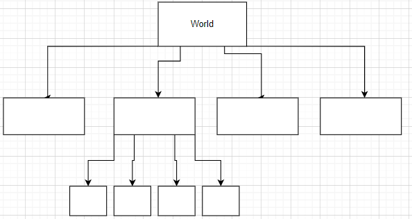
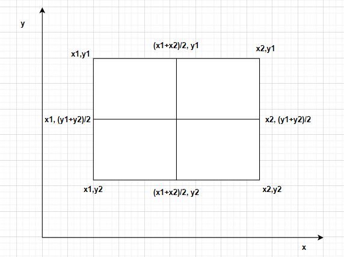
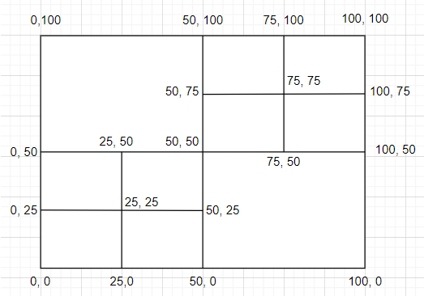

# Quad Trees

### Motivation behind Quad Trees

Every point on the globe has latitude and longitude. With these exact latitude and longitude combination, 
we can locate an address.

A system like Uber takes the location and helps find the cabs in the vicinity.
When we request a ride, uber then sends requests to nearby cab drivers.

In Google Maps whenever we search for barber shops near me, Google Maps then will take our location and find the barber 
shops in the vicinity.

Uber seems to be a comparatively challenging problem since the cab's location keeps changing.

**Our sample problem: Place of interest near me (point: latitude, longitude)**

Steps that need to be done:
1. List all the places of interest (Alim Hakim barber, latitude, longitude)
This is basically a data collection step. To answer the query, we should have data in place.

|Id|Type|Name|Latitude|Longitude|
|--|----|----|--------|---------|

For the sake of convenience assume this data is stored on MySQL and we have around 100 Million places of interest. 

2. For query, check the latitude and longitude provided by user.

Sample: Find petrol pump near me (x, y)

### Iteration 1:

To solve this, we will go through all the hundred million entries and calculate the distance 
square_root((x-x1)^2 + (y-y1)^2). 
This will be a very time taking process. To answer each query, we will need to go through all the records.

We can improve this a bit by introducing indexes on either latitude and longitude. Even after using indexes, there will be millions of entries to compare to find the nearest ones.
Simple indexing OR sharding will not solve the issue as even after it we'll have to consider 10s of thousands of comparisons.

### Iteration 2:

Let's say we divide the world into grids, two-dimensional grids.
Each grid will have some area.

If we want to find restaurants near a grid, we'll locate the grid for which the request is made.
We will search for restaurants in that grid as well as restaurants in some neighboring grid cells.
This helps us reduce the search space.

**How to identify the grids?**

Either provide an id to each grid and store in a hashmap or we can idnetfy the grids with only 2 diagonal points.

**What should be the size of the grids?**

**Having the same size across the globe:** Having the same size is not a great solution since the population across the globe is not same,
the oceans will not have any barber, hence does not make sense to have bigger grids there.
The grid size should instead depend on the population density.

Even though a grid cell solution is a solution in the right direction but it is not without problem.

**Problem:** Unequal distribution of points of interest throughout the world.

### Iteration 3:

Start with one big cell, entire world is one big cell.

Recursively asl below question:

Do we see more than 100 places of interest in this cell?
If yes, divide the cell into 4 cells and for each of the cells ask the same questions.
If no, we won't need to divide it.

**Which Data structure to use to store this quad tree?**

We can use a tree where each node can have four children, if we see more than 100 places of interest, then we will divide it into four child nodes.
The actual location will be stored at the leaf node.

For each node of the tree we will have:
* id: example A1078
* And each node will have 4 points representing grid cell points (top-left, top-right, bottom-left, botton-right)
* And each point will have latitude and longitude

The root of the tree will represent the entire world.

Two tables that we'll maintain in order yo store details:

This stores the details of the grid:

|leaf_cell_id|TL|TR|BL|BR|
|------------|--|--|--|--|
|A1078|x1,y1|x2,y1|x1,y2|x2,y2|

Below table stores the details of the places:

|PlaceId|latitude|longitude|description|Title|leaf_cell_id|
|-------|--------|---------|-----------|-----|------------|

**Finding grid id for a point:**

For a point we will have (x,y) which is latitude and longitude.

Since the root of the tree represents the whole world. We will have to recursively find which child to goto.

How we'll divide the grid in general:

## How to build Google Maps APIs?

**Step 1: Tabulate all the places**

| PlaceId| Place Type |latitude|longitude|description|Title|leaf_cell_id|
|---------|-----------|--------|---------|-----------|-----|------------|

**Step 2: Bootstrap/initialize a Quad tree:**

|leaf_cell_id|TL|TR|BL|BR|
|------------|--|--|--|--|
|A1078|x1,y1|x2,y1|x1,y2|x2,y2|

The relation between the node can be captured using HashMaps.

After this tree like structure and relation is established.
We can update the leaf_cell_id for each of the places.

**Step 3: Now support queries**
* point(x, y) -> find nearby barbershops
* Find leaf_cell_id for (x,y)
* Goto places collection and find 100 places for that cells and filter by barber shop and rank them
* Find barbershops in neighboring grids

**How to find neighbors?**

* Goto parent and ask for siblings. Then goto find grandparent and ask for second level siblings.
* Subtract some delta from the current cell (x, y) either x or y; this will land us in another cell, find shops in this cell. We are piggybacking on the boundaries of the cell.

**Step 4: How to handle a new establishment being created?**
* Find leaf_cell_id[x, y] -> A2078
* Add 890(placeId) in the Places collection
* check if cell_id A2078 has > 100 places. If no, do nothing. If yes, need to divide into four grids and assign the places to the sub-grids.

**Step 5: How to handle if an establishment is being removed?**
* Find the leaf_cell_id[x, y] 
* remove the place from the grid, and check if all the siblings including this one together has < 100 places. If so, merge them back to one grid.
* Remove placeIf from the places collection

## Calculations:

Total number of people: 7 billion people

There won't be 1 place of interest for 1 person.
If there is 1 place for 10 people, there will be 700 million places.
If there is 1 place for 100 people, there will be 70 million places.

Let's approximate it to 100 million places in the world. This is the upper bound.

All these 100 million places will be located in the leaf node and each will have 100 places of interest at max.

Let's assume there will be 20 places of interest at an average per-leaf node.

**How many leaf nodes?**
* Number of leaf nodes = 100 million / 20 = 5 million leaf nodes

**How many nodes in quad tree at the penultimate level?**
* Number of nodes at second last level = leaf nodes / 4 = 5 million / 4
* Number of nodes at third last level = 5 million / 16
* Number of nodes at third last level = 5 million / 64
* Number of nodes at third last level = 5 million / 256

Total number of nodes = 5M + 5M/4 + 5M/16 + 5M/64 + 5M/256 + ... + 1

Total number of nodes = 5M (1 + 1/4 + 1/16 + 1/64 + 1/256 + ...)

Total number of nodes = 5M (a/ (1-r)) - Here a = 1 and r = 1/4

Total number of nodes = 5M (4/3) = 5M * 1.33 = 6.65M approx 6.5 million nodes

How to store these?

The entire storage space will be divided into parts: Places collection (storing 100M places and metadata) and nodes

**How much space needed for one node of quadtree?**

Every node will have four pointers to its children and one pointer to its parent.
In total, 5 pointers (cell_id) in total 5 * 8 bytes = 40 Bytes.

And four coordinates with latitude and longitude in total eight numbers.
8 * 8 bytes = 64 bytes

cell_id = 8 Bytes

For one node = 40 + 64 + 8 = 112 Bytes approx 200 bytes

For all nodes = 6.5M * 200 bytes = 13M * 100 = 1.3 * 10^9 = 1.3 GB

**How to store the places**

PlaceId = 8 Bytes
Title and description = 50 Bytes
Place types = 8 Bytes
cell_id = 8 bytes

With all extra fields assume 100 Bytes per place.

Now 100M * 100 Bytes = 10 * 10^9 = 10GB in total

If we take 200 bytes per place, then in total 20GB in total.

In total = places + quad tree = 20GB + 1.3GB = 21.3GB

This amount of data can be stored in a single machine.
