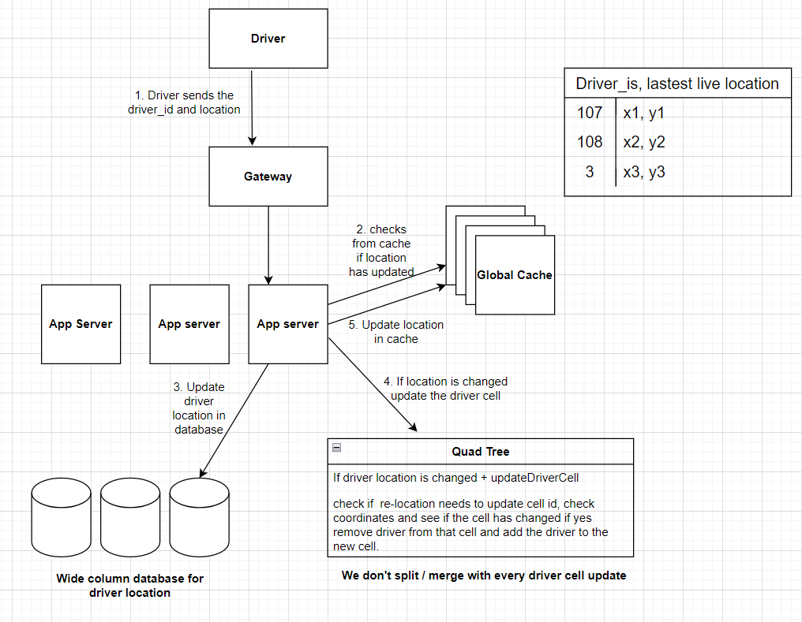
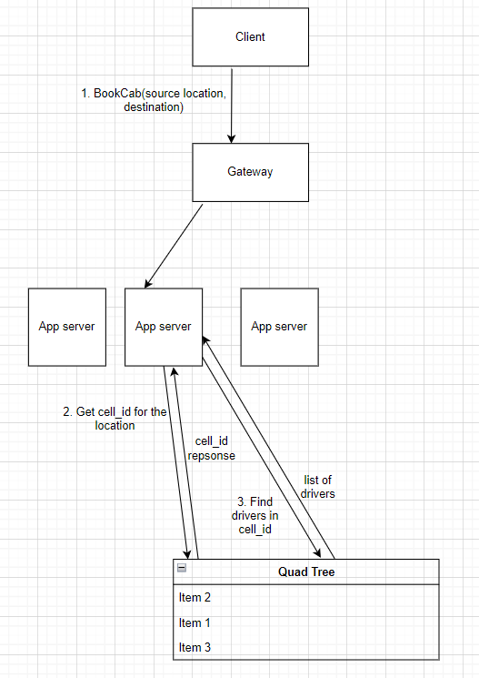

# Design Uber

## How be a system like uber created using quad trees?

In the quad trees discussed earlier, the places were static and would not move.

In the case of Uber, our place of interest, which is a cab, keeps on moving from one location to another.
In case a cab moves,the cell it moves from might need
to be merged back also the grid it moves to might need to be divided.
This means the quad tree is changing too frequently in this case and would take too much bandwidth of our system.

## Calculations:

Total population: 7 Billion
* 1 driver : 1 people = 700 million drivers 
* 1 driver : 100 people = 70 million drivers 
* 1 driver : 10 people = 7 million drivers

Let's say there are 10M Uber drivers in the world.

Consider Uber System to be a collection of small Uber systems.
Suppose we have one uber system for New York, another for Delhi NCR and other for Mumbai.

One user usually will look for cabs in one area.
Uber will have gateway for each of these subsystems.
When a client from mumbai comes and requests DNS for Uber IP. 
Assuming DNS is location based, geo-sharding, the client will get the IP of gateway for Mumbai.

If DNS is not geo sharded, then in that case, suppose the client is routed to New York gateway. 
The system sees that client wants to look for cabs in mumbai and hence will internally route to the server for mumbai. 

## Zooming into one city cluster

Let's look into Uber Mumbai city cluster.

**Uber driver flow:**
* At max, there are 500K divers in Mumbai city.
* We need to create the quad trees for Mumbai city. How to initialize a quad tree given all the drivers keep on moving.
* Based on some parameters that can be a good approximation, we'll create the quad trees. 
For Example, the density of people in city, density of other drivers in city, office locations.
* Initialized Quad Tree
* Every Uber driver based on their current location can be allocated to one quad tree leaf node.
* Every second driver will send the current location to the Uber.
* App server check from global cache if the location has changed in the last minute.
* If yes, then update Driver cell in the quad tree
* Do not split/merge with every driver cell update
* Update the quad tree cell distribution [cell merging + cell splitting] once every 1-4 hours.
* We'll use cassandra like storage system for tracking driver's location because it is good with timestamped data.
* Also update the location in cache for the driver if it has crossed the threshold (significantly).

**Uber client flow:**
* User sends BooCab request with source location and destination location.
* Based on the source location app server finds the cell_id in the quad tree.
* App server requests to find the list of drivers in that cell_id.
* All the drivers will now be sent a notification to accept the ride. How notification is sent is? drivers are connected to the uber system by web sockets or HTTP long polling.

**How to make sure that only one driver accepts the ride?**

Uber essentially has the fastest finger first voting.
Suppose there are 10 drivers
to reach out
to then send notification to the first three and the moment one accepts it block for others and doesn't send the request.
If all three did not respond, then send request to the next three drivers.

In case none of the drivers in the list accept then fetch drivers from the nearby grids/cells and request them.

## How is price determined?

Price is obviously determined by the distance, traffic and time taken but also the number of drivers in a particular cell.
The number of drivers available, the lesser the price is.

