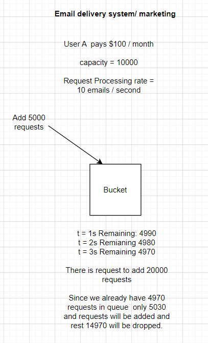
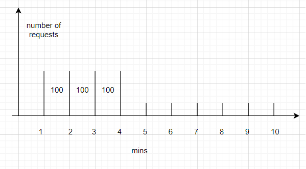
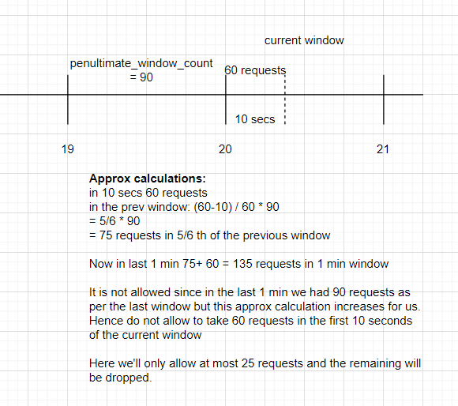

# Popular interview questions

## Design unique Id generator

Generate unique ids (numeric ids—8 bytes-long).

The size 8 byte because it is not too small that it would restrict us from generating ids for a huge number of records.
Also, it is not so big that it would cause a storage overhead on the system.

* All the ids should be unique
* The ids generated must be incremental

**Need for unique id:**

To get idempotency, we need to generate new id for every record in a database.
It is a basic requirement of a system.

1 bit can have two values either 0 or 1.

1 byte = 8 bits
8 bytes = 64 bits

Therefore, 64 bits can have 2^64 different values of ids.

### Iteration 1: Auto incrementing ids like SQL

Give simple increment ids from 0. There is a single machine which would generate ids for all the requests coming to it.

* All the ids should be unique—satisfied
* The ids generated must be incremental - since its tart from 0, and we are providing ids +1 everytime. We can determine which record cam later in time.

**What if the system/machine goes down?**

This is a single point of failure. If the only mahcine fails we'll lose all the info about last id generated and, then again generate from 0.

**What if we try to have more machines as id generators?**

We can scale up and in parallel generate ides for requests coming to the system.

If each machine in this cluster generates id from 0, it does not resolve our issue because we want unique ids.
If we want them to work in sync, then we would have to take a lock between these machines and then generate id and share the id that was last generated.

### Iteration 2: Round-robin between the machines

Suppose there are 3 machines and between these three machines we have a single gateway/proxy which would assign request to them in round-robin fashion.
* At t1 request to S1 - return 0
* At t2 request to S2 - return 1
* At t3 request to S3 - return 2
* At t4 request to S1 - return 3
* At t5 request to S2 - return 4
* At t6 request to S3 - return 5

If a machine is down, then ids from that machine will be missed.
And later point of time if that machine comes up then it will generate those missing ids which would be smaller than the ids generated by the other machines,
thus violating the required incremental ids. 

**Why not use UUIDs?**

These are 128bit ids that are unique but are not incremental.

### Iteration 3: Timestamp based solution:

We will use timestamp and server_id to generate id.
Timestamp + serverId

Server_ids: 201, 207, 107, 109
* t1+201
* t2+109
* t3+207

At the same time, if 2 requests come, then we can differentiate by the serverId.
Hence, maintaining the uniqueness.

Problems:
* if at same second/time if 2 requests come to same server then no uniqueness is maintained. The Same id will be generated.

### Final solution: Twitter Snowflakes Algorithm

It is a 64-bit solution. Every snowflake that falls is unique in its shape/orientation.

* There are multiple machines in the cluster working to generate ids.
* The first or most significant bit of the 64-bit id is sign bit.
* The next 41 bits are assigned for timestamp.
* The next 5 bits of datacenter id.
* the next 5 bits is the machine id.
* The last 12 bits is the sequence number.

**What twitter does:**
* The first bit is always fixed to 0. (1-bit)
* The next 41 bits is the epoch time. (41-bits). We can store 2^41 timestamps (to precision of seconds) approx 69000 years. If sensitivity is in milliseconds, then approx 69 years.
  69000 is very long time for a system to persist; 69 years seems good for a system.
  Instead of taking 1st Jan 1970, Twitter engineers decided to take base time as 4th Nov 2010 (cutoff date).

* There can be 32 datacenters as 5 bit used for it.
* And each datacenter will use at most 32 machines.
* Sequence numbers 12-bits are reserved for generating auto incremented sequence numbers. There can be 2^12 numbers per machine (4096).
It is reset to 0 at every millisecond.

> Epoch time is the number of seconds that has passed from 1 Jan 1970.

**If we build a system today does it make sense to use 2010 as cut off year?**

No requests will come for past dates.

**In case we want to use this but we don't have datacenters?**

In case we want to use this and we don't have datacenters, in such a case we can use 10 bits for machines (5 from datacenters and 5 from machines).
Meaning we can use 2^10 (1024) machines working parallely to generate ids for us.

**What will happen in case we have requests on a machine at same time?**

In case, a requets comes to a machine a sequence is assigned to it and if another requets comes now everything in the id remains same except the sequence number which will be incremented in this case.
Given the milliseconds have passed the counter/sequence number is set to zero.

**What is the significance of MSB since it is always set to 0?**

Given MSB is always set 0 and used in any case. It can be used in cases when we want to mark a record/id for deletion.
MSB in this case can be set to 1. 1 means the id is deleted.

# Design a rate limiter

If there is a service A which depends on another service B, there is SLA between these services that service B can handle
100 or 1000 requests per second meaning a service would throttle the requests coming from a service or client.

For Example, if we are browsing Google from a public network, then at times we get check boxes to confirm that we are not a robot.
we are often asked to complete a quiz to confirm that we are human, it is because Google has set a rate limit on the number of requesting coming form an IP.
Beyond a certain number of requests, it wants to confirm that the requests are not coming from bot.

A service might want to limit the number of requests it wants to receive.

**The rate limiting can happen at:**
* client side: The client might decide that it does not want to disturb the server after x number of requets.
* server side: The server might decide that it is getting too many requests from the a client and this won't respond to it.

Http Status Code: 429 is used by server in this case.

## Algorithms for rate limiting:

### Token Bucket Algorithm

* There is a bucket per IP/id/device etc.
* There is capacity defined for each bucket. Suppose, capacity is 100.
* There is a rate at which token are filled in the bucket. Suppose, the rate is 1 token / 0.1 seconds.
* For a request to be served, we need to take out a token from the bucket. Thus, limiting the number of requests processed or served by the service.

Looks like a smooth way of handling rate limiting.

**We are maintaining a new bucket of token for each IP or device. Is it overhead?**

No, it is not an overhead cause the bucket here is essentially a counter with maximum limit which is maintained against the IP or device.

In case a bucket is full, the request will not be served or and simply dropped.
There is no concept of request waiting in the bucket.

### Leakey Bucket Algorithm

No tokens are used, but instead the requests are added to the bucket.
Instead of dropping request in case the token bucket is full.
If the bucket is full, then the service will keep the requests in a waiting queue instead of dropping out the requests.
There is an upper limit on the number of requests that can be queued in the waiting queue.

Every passing second, as the requests from buckets are processed (rate of outflow/processing), the queue gets smaller and smaller.
The queue gets more space and hence more requests can be added to the waiting queue.

### Fixed Window Algorithm

We are going to have windows/buckets created of time intervals.

Every window allows a certain number of requests to be served, if in that window all the number of requests received by the
system is less the remaining requests are not carried forward to the next window.

Suppose in 1 min there can be 100 requests served if in the first min the 100 requests are not served and only 10 are served and 90 are remaining,
these 90 will not be carried forward and will lapse. In the next 1 min again only 100 requests will be served.

The System does not get a burst of requests at any point of time.

Example: the data limit on our phone plans, 1GB/day is refreshed every day at 12:00am.

**Why this system fails?**

Suppose we are making 100 requests per min. Now the user does not use the system throughout until the very last 5 secs of a window and 
first 5 secs of the next window, utilizing all the 100 requests/window capacity.
In this case, the system encounters more than 100 requests per min which is more than the anticipated load of 100 requests per min. 

Anticipated load = 100 requests per min

Actual load = 200 requests per 10 sec = 1200 per min

The intention with which the algorithm was designed is defeated and hence this is not used a lot.

### Sliding Window Counter

This is an approximate algorithm. Window capacity is again 100 requests per min.

We are not allowing 100 in bursting nature.

