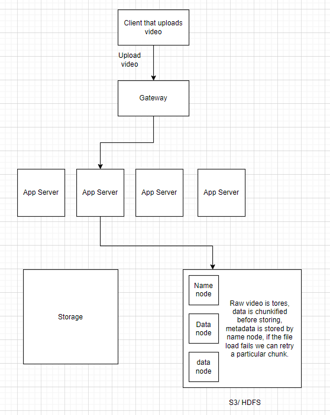
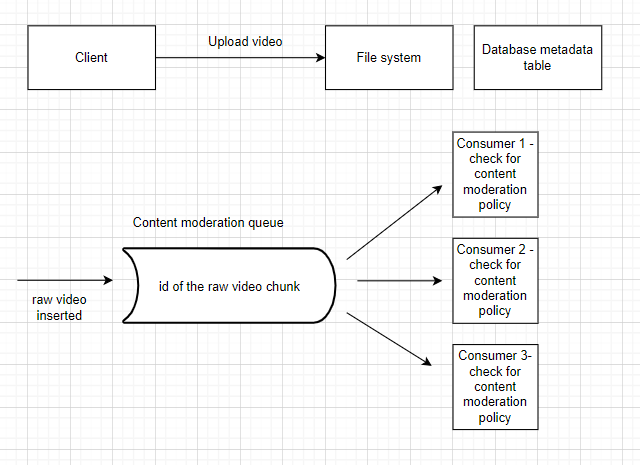
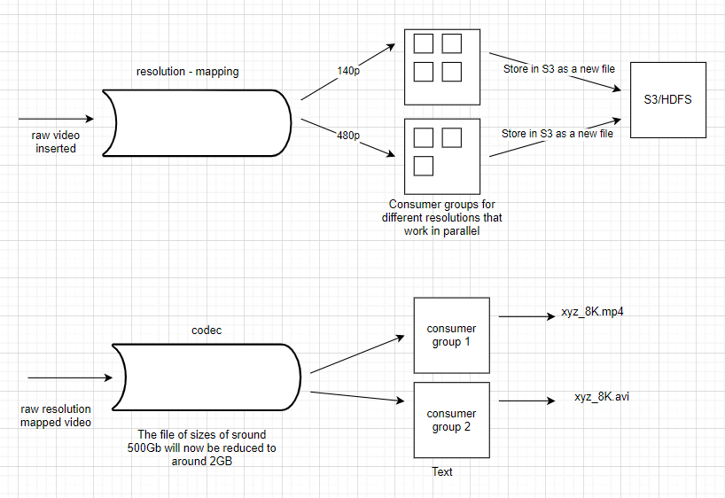
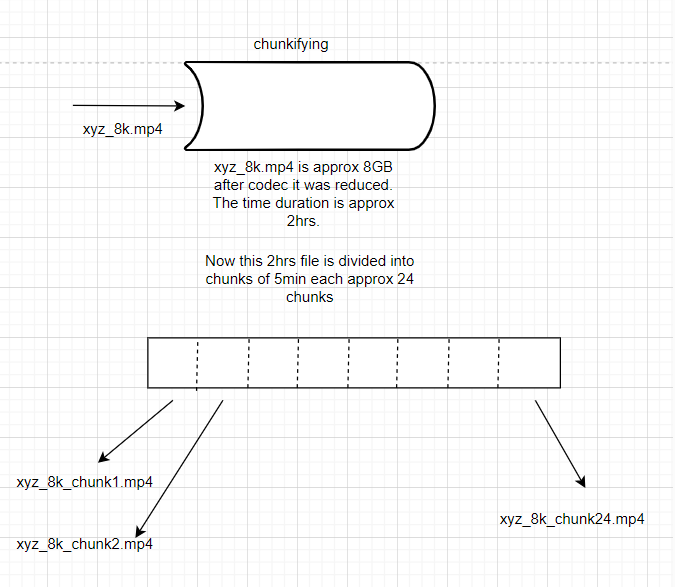
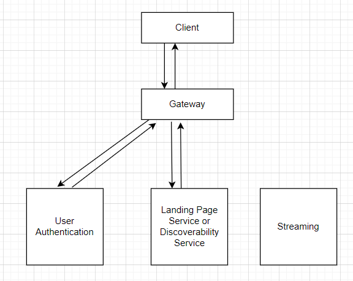
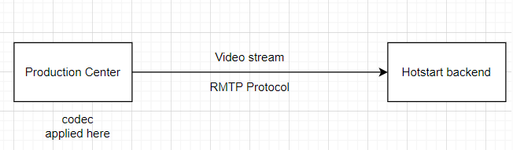

# Design Hotstar / Any Streaming Platform

Hotstar is an online streaming platform.

There are two types of content that are served.
Most of the streaming platforms serve only the recorded or static content.
However, the Hotstar serves live content.

**Will we use CDNs for recorded content?**

The answer is yes, for recorded contents CDN will be bread and butter (core component).

There are three components for live-streaming platforms:
* `Ingestion of data:` how data is ingested and stored in systems like these
* `Discoverability:` once we have all the data store how can a user search the content, search bar or suggestions. Contains mostly watch history, suggestions and search. 
* `Streaming:` Actual transfer of content to the user to watch a content

## Ingestion of data

A video has different codec (compression-decompression) formats.
There are different formats like mp4, mkv, avi, etc.
Also, there are different video resolutions like 480p, 720p, 1080p, 4k, etc.

A video in its very essence is a sequence of images/frame played very fast one after other.
The higher the number of frames in a video per second the better the quality of the video.

**What is the resolution?**

Resolution is the number of pixels in a frame or image.
If the image is black and white, each pixel will have value in range 0-255.
If the image is colored, then each pixel will have 3 values (RGB) in range 0-255.
If an image has a larger number of pixels, then it will have more details and will be of higher quality.

> The higher the resolution, the higher the data points we need to transfer the user and the higher the storage requirement.

**Calculations:**

On average, the movies are 2hrs long. 

Suppose we have 30 frames per second (fps) in a movie.

So, 30 * 60 * 60 * 2 = 216000 frames in a movie.

the resolution is 720p (1280 * 720 pixels).

Total number of pixels in a frame = 1280 * 720 = 921600 pixels.

Every pixel will have 3 values (RGB) in range 0-255.

For each pixel we'll need 3 bytes.

For all pixels 921600 * 3 = 2764800 bytes.

For the whole movie, we'll need 216000 * 2764800 = 597196800000 bytes = 597.1968 GB.

We are doing this calculation on raw videos, uncompressed video.
When we apply codec on top of this, the raw video turns into approx 2GB of data.

**Will Hotstar serve raw video or codec video?**

Hotstar will serve codec video.

**Experience for the end user**

Every customer will have different internet connect working at different speeds.

The data/video that we play are not stored on our system, they are stored on the server.
Also, we do not have to download a video to watch it.
There is a continuous stream of data that is sent from Hotstar server to our machine, and we watch it.

### Ingestion Pipeline

* Upload the raw video ans it is stored in File storage system. Also, the Database metadata table is updated for the newly added video.

Metadata that is usually stored:

|id| title |owner|size|s3_link|
|-|-------|-----|----|-------|

* Perform content moderation on the video. Check if the content moderation policy is met.
* Convert to different resolutions and create copies
* Apply codec to the video
* Store the processed video in the storage system. 
* To store this processed video, we need to divide it into chunks and store it in the storage system.
This chunkifying is different from the chunkifying that S3 or HDFS system does.

As we watch a video, the video is getting downloaded in chunks.
Our system preemptively downloads the next chunk of the video so that there is no buffering while watching the video.
But if we are watching a video and we seek it to some later timestamp,
then we will see some delay in loading since we have to wait for the chunk to be loaded.

Now suppose if we have already watched a video our system will not download the video again, it will just play the video from the cache.
If the video is removed/evicted from the cache then only the system will download the video again.

Now suppose we got an input of 1TB raw video, it will be stored in S3.

Number of chunks = 1TB / 128MB = 8192 chunks.

This raw video will be converted to smaller resolution videos and then stored in S3.

raw_video_144p of size 100GB

Which means number of chunks = 100GB / 128MB = 819 chunks.

for each video format, the videos will be stored in S3.

When we apply codec to these videos, the size of the video will be reduced to 4GB.

The Number of chunks to be stored here will be 4GB/128MB = 32 chunks.

Now we don't want to send this 4Gb file to the user in one go, we want to send it in chunks.

Now we create small logical chunks codec_video_144p_chunk_1, codec_video_144p_chunk_2, etc.
Each of these chunks will be of different sizes.
Now suppose one of the chunks is 500MB, then we will have 500MB/128MB = 8 chunks for this video.

Each of these chunks will have their metadata which will also be stored.

Most of the processed videos will also be stored in CDN network. There has be an agreement with CDN companies to host and serve this data in their network.
This will help in reducing the latency and also the load on hotstar servers.
The smaller the distance between the user and the server, the faster the data transfer.

## Discoverability

This composes multiple components:
* `Full Text Search` -> Elasticsearch
* `Continue Watching Feature and Recommendation` -> Just like facebook newsfeed

There are different services that are running in the background to provide these features.

We go through a bunch of videos before we decide and watch a video.
The results that we see contain the metadata and the video thumbnails.
The thumbnail that we see will be created as part of ingestion pipeline. A new step can be added to generate a thumbnail.
The thumbnail will also be stored in S3.

## Streaming

Every client will have its own device, internet connection and will have its own requirement.
The clients will make call to gateway and app servers and will rely on CDN for data streaming.

**How to ensure a good experience for varied clients?**

The answer is adaptive streaming. Adaptive bitrate Streaming (ABS)

**Adaptive bitrate Streaming (ABS)** 

The video is divided into chunks and each chunk is of different quality.

Hotstar keeps track of the following details:
1. `User Internet Speed:` As a server it tracks how much time a user takes to make the next subsequent request or to download a chunk. This is called user agent tracking.
2. `Device:` The device on which the user is watching the video. What all devices a user uses to watch the video. What is the resolution of the device? What is the screen size of the device? This is called device fingerprinting. There is unique id assigned to every device.

* The client will make a request to load the streaming metadata.
* Metadata that would be loaded will contain the information about the video, timestamp of the video, title of video, description of video, review, ratings and comments for the videos.

> A user can seek through video without actually playing the video. This possible because each chunk has a video thumbnail and as we seek through the video, the thumbnails are loaded from different chunks.

Metadata will include:

* Title, Description, Comments, genre, cast and rating
* All chunk metadata: 

| chunk   | time range | video thumbnail |
|---------|------------|-----------------|
| chunk_1 | 0-2 mins   | thumbnail_1     |
| chunk_2 | 2-4 mins   | thumbnail_2     |
| chunk_3 | 4-6 mins   | thumbnail_3     |

All the above information is loaded when user opens the video but the streaming has not started.

**Why to wait for user to hit play button?**

Load some chunks preemptively. getVideoChunk(107, chunk1), getVideoChunk(107, chunk2), getVideoChunk(107, chunk3)

This helps us to play video without hitting the play button.

**How to decide which chunk to load preemptively?**

The answer is based on the analytics data. An analysis of done for each video and the chunks that are most watched are loaded preemptively.

the first few chunks and the most watched ones are returned as part of the metadata and client will then load these chunks. 

We can have a cache client side to store the chunks that are already loaded. We have LRU cache to store the chunks.

## Live-streaming of content

**What is the structural difference between live and regular content?**
 - The live content is created at the same moment it is streamed

**What is the difference between live and regular content?**
- We don't have enough time for ingestion and processing. 

There is a place where an event is happening, the live content is getting recorded at that place.
This live feed is getting translated to a production center (RTMP).
The production center is where the video is getting edited, the video is getting cut, the video is getting translated, the video is getting added with subtitles, etc.
However, in case of live-streaming we have little scope for editing.
This production center can be managed by Hotstart or by a third party as well.
The production center will decide which feed to be shown to the user. 
In the case of cricket, we'll have multiple cameras and the production center will decide which camera feed to be shown to the user.
Manager at a production center will combine the stream received from 15-20 cameras and convert it into single stream.

RTMP (Real time messaging protocol) is a protocol used to send live video feed from the production center to the hotstar server.

**The real problem is how to send this live content to millions of users.**

**Is there any latency involved in this?**
- The Answer is Yes.

Live-streaming is not the same as video calls or live classes.

Do we send raw video from a production center to the hotstar server?
- The Answer is No. We should not send raw video. It adds on to the latency.
- This video should be a codec video to reduce the size of the video.

In regular video streaming, We create chunks of size 2–3 min of a video and send these chunks to the user is sent for streaming. 
In live-streaming the chunk size should be way smaller, let's say 15–30 seconds each.

Once this chunk is created, it is sent to the hotstar server.
The hotstar will have an ingestion pipeline running at backend that will convert to different resolution.
The pipe produces 15–30 sec chunks of different resolutions and stores them in S3.
Also, there will be metadata stored in the database for all the chunks.

All the metadata will not just be stored in a database but also in a global cache.
The global cache will be used to serve the metadata to the user.

Metadata is small instead of storing it in CDN and returning the url for CDN to user,
we store the metadata in cache and return the metadata to the user.

The video content will be stored in CDN. Thus preventing hotstar server from getting overloaded with all the requests to serve the video.
Hotstar server will reply a user with CDN url to the video.
CDN url will be stored in metadata.

CDN is used for static data, but in case of live-streaming, the data is not static.
The data is changing every 15–30 seconds. However, once a ball is played in cricket, it is not going to change.
Meaning the chunk is never going to change and hence is static.

Till now, we have done three things:
1. Store video chunks of different resolutions in S3
2. Populate meta data in DB + global cache
3. The chunks will be sent to CDN

### Streaming for live feed

In case of regular video, we send the metadata for all the chunks at the very beginning, and then the user can seek through the video.
In the case of live-streaming, we don't have the metadata available at the beginning.

In streaming platforms like hotstar, we can watch at own pace, meaning if we are lagging behind the live feed, we can watch the video at our own pace.
Different people can watch the video at different pace. Meaning people will require different metadata depending on the chunk of video they are watching.

In the case of live class like scenario, we can't watch at our own pace. We are forcefully brought to the live feed.

In live-streaming user will send call getChunkMetadata(last_chunk_id, number_of_chunks). 
The hotstar server will check the last_chuck_id and will return the metadata for the next number_of_chunks.

In the case of live-streaming, getChunkMetadata() will be made multiple times.

Think why we need to client to make this call and not hotstar send these data automatically in some intervals.

**How do systems like hotstar scale up/down drastically?**

There are three components in systems like these:
1. `Ingestion` - With the number of users increasing, there is no change to ingestion of the video.
2. `Discoverability` - With the number of users increasing, there is change to discoverability of the video. Instead of displaying all the videos and a lengthy suggestions list, we can display only the few most popular suggestions.
3. `Streaming` - With the number of users increasing, for metadata fetch we need to increase the app server and global cache. For video streaming, we need to increase the CDN along with app server and cache.

**How is hotstar different than live class?**

* In a live class we have a limited number of users, but in hotstar we have millions of users.
* Live class is a two-way connection, a student can ask question which should be delivered to the teacher. In case of hotstar we don't really need this type of communication.
* In a live class we have static connections (HTTP long polling or web-socket connections) but in hotstar we have dynamic connections. 
* In hotstar any user can come and ask for any chunk of the feed. In case of live class, the user is forced to watch the latest feed