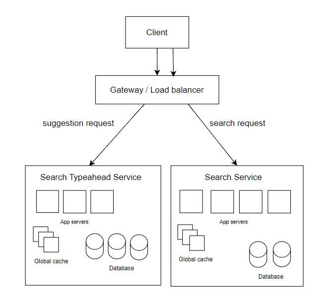
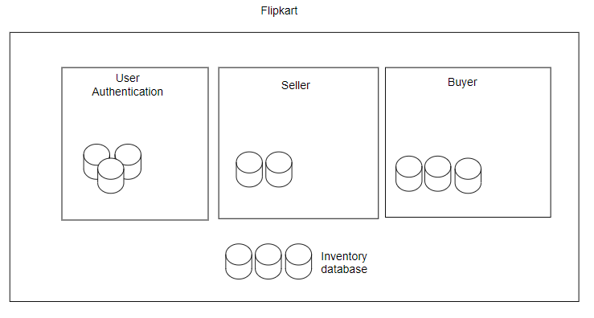
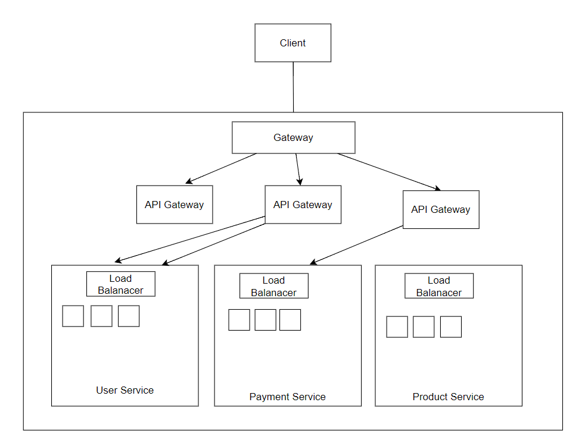

# Microservices

micro means small

**What do we mean by services?**

Service is a logical group in backend system that does one particular thing.

For example, search typeahead service, it will have a service that will serve the suggestions needed while another service to 
handle requests for actual search results.

Each of these services will have a dedicated set of app servers, databases and global caches.
We can have a shared database between services.

Let's have an example of flipkart.

Flipkart will essentially have these 3 services:
1. User Authentication—help with user authentication
2. Seller service—which does everything seller related
3. Buyer service—which does every job with respect to a buyer

We can have user database, seller database,
buyer database in respective services and have an inventory database that will be shared by seller and buyer.

Example of Facebook:
1. User Authentication—Login logout service
2. Newsfeed service—to create and refresh the user newsfeed
3. Advertisement services - Helps to display relevant ads

In case of hotstar:
1. Ingestion service 
2. Discovery service
3. Streaming service

## Monolith vs. Microservice

An architecture where for an entire product we have only one big service and everything is done by that service is called monolith.
Even if we have two, three, four big services, we can still call it monolith.

If for a system, we have a huge number of 1000s of services. A service for every small job.
A single service can expose multiple APIs.

Bear minimum requirement for each service is that they will have its own architecture, dedicated app server and database.
We will create a particular deployable for each of them.
We will deploy them on different machines (jar, war)
Every service is going to have a different deployable.

If we have a monorepo - single repository for all the code.
Even in a monorepo, each folder/service will have its own build file.

If we have multi-repo - multiple repository for each service.
Every repo will give its own deployable. 

## Advantages and Disadvantages

| Monolith                                                                                                                                 | Microservice                                                                                                   |
|------------------------------------------------------------------------------------------------------------------------------------------|----------------------------------------------------------------------------------------------------------------|
| Since everything is inside one service, if we make very small code change we will have to redeploy for all machines                      | Since we have many services, change in one service will cause only one service to redeployment.                |
| Developer onboarding is very difficult - blast radius is high (small changes can have bigger impact)                                     | Developer onborading is easier, since he has to understand thoroughly only one service. Blast radius is small. |
| For huge code, build time will be high, deployment time will also increase                                                               | Build and Deployment time will decrease since we are dealing with one service.                                 |
| I will have single deployable (one particular tech stack) - kills the flexibility to choose different tech stack for different requirements | We can choose different teach stack for different services depending on the requirements                       |

**Downside of microservices:**

With every new service, we have the overhead of managing a new service:
1. Have a dedicated deployment pipeline
2. Test suite
3. Monitoring for machines, CPU utilization

**Inter service communication:**

For example, Swiggy will have these services:
1. Restaurant search service
2. Order creation
3. Restaurant service
4. Authentication service
5. Rider Partner service
6. Payment service
7. Notification service

From day 1 if we have so many services, handling so many app servers and managing the communication may be feasible. 
Also, the system might not be fully utilized.

**Error resolution is difficult**

### How to start a new product?

**Strangler Fig Pattern**

1. Start with Monolith or single service
2. When we realize the user base is growing, from all the services choose once which is most frequently used or is needed for other flows (ex. authentication).
Move this service to a separate service.
3. Re-iterate and separate services based on services which seem like independent use-case and have interaction with other services. (Payment service)

## Flipkart
All the functionalities in Flipkart:
1. Landing Page
2. Search
3. Authentication
4. Product
5. Order
6. Payments
7. Delivery

If all the above services combine to a single deployable executable, then we will have to deploy them on all the app servers.

The problem is that we are trying to solve problems with all the services from the same code deployable.
1. We have a tight coupling in code deployments: even a small change in one logical use case will require us to rebuild the entire code and redeploy on all machines.
2. Deployment time will be very high, huge time for unit testing and huge building time.
3. If in future we analyze that search request is taking a lot of time, we will try to add more machines to the cluster. 
   Now, to scale search, we'll again deploy the same war on the new app servers.
   Deploying this war will not just support search but scale all other services as well.
   We cannot scale a targeted service.
   Targeted scaling is not possible.
4. We cannot use different tech-stack for different use-cases.
5. Developer on-boarding is very challenging.

**Filpkart as multiple services:**

**User Service use cases:**
1. Sign up
2. Login
3. Change password
4. Change profile details

**Product Service use cases:**
1. Add product
2. Update product
3. Search product

**Payment Service use cases:**
1. Make payment
2. Check payment status

When we have multiple services,
we cannot go to a specific app server or application layer since we are not aware which service a request should go to.
Hence, Gateway + load balancer is called only gateway.

Now to decide to which application layer the request should go to, we have introduced API Gateway.
There is not just one API gateway machine we can have multiple API gateway instances.
API gateway looks at the API invoked in the request and passes it to the relevant service.

Once we have reached a service, we still need to decide to which app server the request should be passed for processing.
There is a Load Balancer that decides to which server the request will go to.
If the Service is stateless, we will use Round Robin to allocate the requests if not we will use consistent hashing.

**Can we have Gateway and API Gateway separate?**

To the outside world, ideally one machine is exposed, and that is the gateway.
Gateway machine will run all the security checks for the requests it receives.
Once the request is authenticated, it will pass the request to other inside machines of the system.

API Gateway on the other hand has a job to redirect the requets to the correct service.
It might not require the same level of security as that of Gateway machine.

Both of these have complete different thought processes while working and we will not want to expose too many machines to the outside world.
Hence, these are kept separate.

**Advantages:**
1. We can do targeted scaling, since all the services are separated, we can add more app servers to product service if the load is high, or it is not performing well.
2. We can use different tech-stacks for all the different services.
3. Developer onboarding is simpler, blast radius is less.

**Disadvantages:**
1. More the number of layers means more latency, since all the services will need to communicate to complete a task. Network latency.
2. It is costly since we need more resources, each service will need a load balancer. Developer cost. The Cost of maintaining is also high.
3. Need additional investment in tracing + logging + monitoring services.
4. Inter-service communication + Data inconsistency since too many services and at too many places we need to store the data, there are very high chances of data inconsistency.

