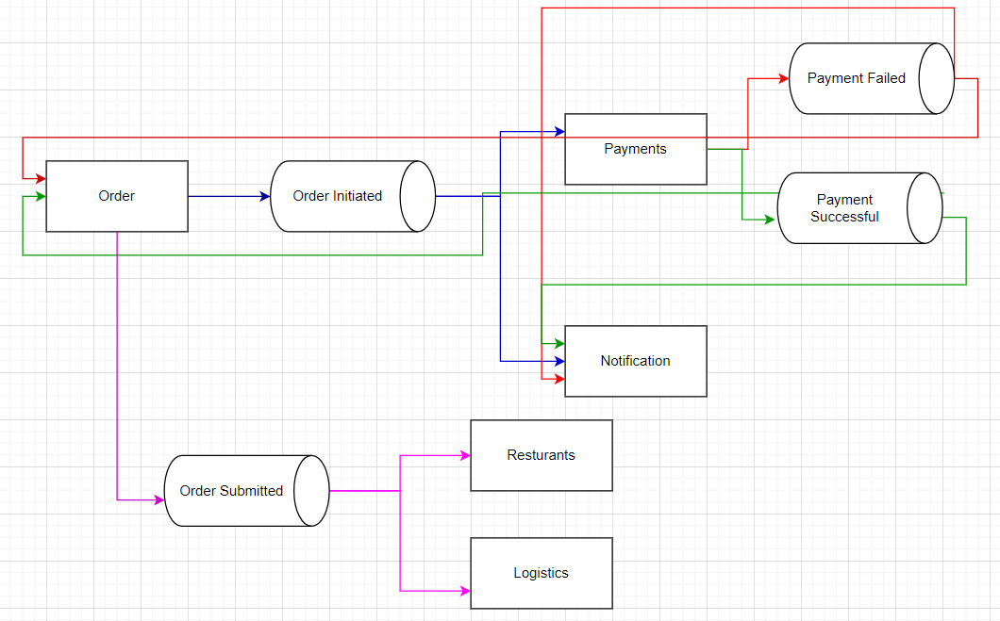

# Microservices

Agenda:
- [Communication between services](#communication-between-services)
- [Observability](#observability)
  - [Logging](#logging)
  - [Monitoring the metrics](#monitoring)
- [Transactions in Microservices](#transactions-in-microservices)
    - [Data inconsistency](#data-inconsistency)

## Communication between services

When we have multiple services, we need to communicate between them.

Let's take an example of Swiggy, when we order food from Swiggy, we have multiple services involved.
1. Authentication service
2. Search service
3. Order service
4. Payment service
5. Restaurant service
6. Logistics service
7. Notification service

When we order food, we need to authenticate the user, search for the restaurant, place an order, make a payment, and deliver the food.
Also, we need to notify the user about the order status.

* One way to communicate between services is using REST APIs.
Making API calls in a synchronous way is not a good idea because if one service is down, the entire flow will be blocked and we might need to retry calls request.

* Another way is RPC (Remote Procedure Call) - gRPC is a good example of this.
gRPC is a high-performance, open-source universal RPC framework.
Protobuf is used to define the structure of the message that is sent between services.
  * Call a particular function in another machine remotely. It is synchronous in nature.
  * All these machine or services follow a common set of classes/objects or datatype which are called Protobuf.
  * Protobuf is a language-neutral, platform-neutral, extensible mechanism for serializing structured data. Meaning the services need not be in the same language.

* Another way is using message queues like Kafka, RabbitMQ.
Rather than calling each service, we can publish a message to a queue and the service can consume the message from the queue. 

This is called `event driven architecture`.
It is async mechanism.

## Observability

Observability has two parts:
* Metrics
* Logs

### Monitoring the metrics
When we have multiple services, it is important to have observability in the system.

Observability is the ability to understand what is happening inside the system by looking at the logs, metrics, and traces.
How the system is behaving, how the services are behaving, how the requests are flowing, how the services are communicating.
How to trace error and check if service is up.

Different metrics to be monitored:
* CPU utilization
* Memory utilization
* Latency
* P95, P99 latency
* Average Queue size
* Percentage of errors

All the metrics should be collected in a centralized database.
Centralized databases which keep track of these metrics with time are called time-series databases.
Grafana is a good tool to visualize these metrics. Prometheus is a good tool to collect these metrics.

Once the metrics are collected, we'll have monitors or alarms/alerts set up which would then notify the team if the metrics go beyond a certain threshold.
One product is AWS CloudWatch which can be used to set up alarms.

* Every machine across services sends metrics at some periodicity.
* Centralized database (time-series database) stores these metrics. Similar to wide column database
* Plot graphs these aggregated values on Grafana.
* Set up alarms on these metrics.

### Logging/ Tracing

Distributed tracing or logging is important when we have multiple services.
When a request comes in, it might go through multiple services.

Every machine in an ecosystem is going to send some logs at some stage.
If there is a single server, it is basic to debug, but when we have multiple services, it is challenging to debug.

There is ELK stack (Elasticsearch, Logstash, Kibana) which can be used to collect logs.
Logstash is used to collect logs from different machines.
Logs from all the services/machines are collected and stored in elastic search.
Kibana is used to visualize these logs.

Kibana allows us to search, view, and interact with the logs that are stored in Elasticsearch indices.

1. Unique Trace Id gets passed along for the same request across all microservices.
ex. We can generate a msgId and keep on passing it at every step.
2. If we have logs related to this unique traceId everywhere, and we are able to collect all these logs at a central place,
then we can aggregate or search by this id. 
3. The stage/point where the logs are missing (if any), that is where error happened.