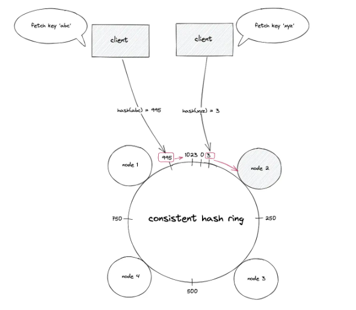

# Scaling and Load Balancing

## Horizontal Scaling in delic.io.us
1. buy a domain
2. static public IP address
3. DNS mapping IP - domain

delic.io.us will not tell the client that I have multiple machines and all of these machines will be reached via the single static IP address in DNS.

How is it possible?

The Answer is through Gateway machine.
Gateway machine will run on the registered IP address of delic.io.us.
This machine's responsibility is only one thing, to take the request that comes from the outside world and forward it to one of the internal machines.
Mostly used for security reasons to see if requets comes from a server which is blocked etc.

Gateway usually follow Active Passive Gatewaying—There is an active machine that actively takes up all the requests and performs the task, in case this machine is broken or down then passive machine takes up the role of active machine and becomes the new active machine. The IP address will not change.

We can have gateway as a service or sharded gateway or multiple gateway machines.

`Forward Proxy` called a proxy, proxy server, or web proxy is a server that sits in front of a group of client machines. When those computers make requests to sites and services on the Internet, the proxy server intercepts those requests and then communicates with web servers on behalf of those clients, like a middleman.
* To avoid state or institutional browsing restrictions - firewalls
* To block access to certain content 
* To protect their identity - Only IP of proxy server will be visible

`Reverse Proxy` is a server that sits in front of one or more web servers, intercepting requests from clients. This is different from a forward proxy, where the proxy sits in front of the clients. With a reverse proxy, when clients send requests to the origin server of a website, those requests are intercepted at the network edge by the reverse proxy server. The reverse proxy server will then send requests to and receive responses from the origin server.
* Load balancing - to handle million of requets/ traffic distribution
* Protection from attacks - never revealing the IP for internal/origin servers avoid DDoS attack.
* Global server load balancing (GSLB) - In this form of loas balanicng, a website can be distributed on several servers around the globe and the reverse proxy will send clients to the server that's geographically closest to them. This decreases the distances that requests and responses need to travel, minimizing load times.
* caching - A reverse proxy can also cache content, resulting in faster performance. caching at different geographical locations.
* SSL Encryption -  Encrypting and decrypting SSL (or TLS) communications for each client can be computationally expensive for an origin server. A reverse proxy can be configured to decrypt all incoming requests and encrypt all outgoing responses, freeing up valuable resources on the origin server. 

## What is load balancer?
It is a machine that directs and controls the traffic between servers and their clients. It distributes the load among the servers.

Gateways can act as load balancer.

## Types of load balancing

-----------------------------------------
1. Stateless load balancing
2. Stateful load balancing

> Stateless Load Balancing - If all the machines in the backend cluster are equally well-equipped to handle incoming requests then it's called stateless load balancing.

#### How Stateless load balancing can be done?
1. Assigning incoming requests in a Round Robin manner.
2. Assign requests in random manner

> Stateful Load Balancing - Even if all the backend machines are running the same code

Ex. Suppose ChatGPT receives a request to add 2 numbers and then second to code it up in C++. Wr have follow-up questions in this case. 

In case we can have follow-up requests then server who previously responded to the request needs to take the follow-up request. Other server cannot take up that request as it would not have context of the previous request.

#### How Stateful load balancing can be done?
Clearly Round Robin will not work here.

##### 1. Simple Hashing
(request_id) % (number of servers) = server_id to which request is assigned

If there are 5 machines each of them will share 20% load.

Now if the number of requests increase then how do we handle it?

In case of stateless load balancing we could have simply added a server, and it would work without any problems. 
But in case of stateful load balancing we would need to move the states as well.

But how many states do we need to move?

| Request_id | % 5 | % 6 |
|----------|-----|-----|
| 101      | 1   | 5   |
| 102      | 2   | 0   |
| 103      | 3   | 1   |
| 104      | 4   | 2   |

From above table we see not just some but all the states need to be moved.
This makes simple hashing inefficient. It is not able to handle add machines are remove machines. 

##### 2. Consistent Hashing

**How does consistent hashing work?**

At high level, consistent hashing performs the following operations:
1. The output of the hash function is placed on a virtual ring structure (known as the hash ring)
2. The hashed IP addresses of the nodes are used to assign a position for the nodes on the hash ring
3. The key of a data object is hashed using the same hash function to find the position of key on the hash ring
4. The hash ring is traversed in the clockwise direction starting from the position of th ekey until a node is found
5. The data object is stored or retrieved from the node that was found

**Terminology**
* Node - A server that provides functionality to other services.
* Hash Function - A mathematical function used to map data of arbitrary size to fixed values.
* Data partitioning - a technique of distributing data across multiple nodes to improve the performance and scalability of the system
* Data replication - a technique of storing multiple copies of the same data on different nodes to improve the availability and durability of the system
* Hotspot - A performance-degraded node in a distributed system due to a large share of data storage and high volume of retrival or storage requests
* Gossip protocol - peer-to-peer communication technique used by nodes to periodically exchange state information

Consistent hashing is a distributed systems technique that operates by assigning the data objects and nodes a position on a virtual ring structure (hash ring). Consistent hashing minimizes the number of keys to be remapped when the total number of nodes changes.

The basic gist behind the consistent hashing algorithm is to hash both node identifiers and data keys using the same hash function. A uniform and independent hashing function such as message-digest 5 (MD5) is used to find the position of the nodes and keys (data objects) on the hash ring. The output range of the hash function must be of reasonable size to prevent collisions.

The output space of the hash function is treated as a fixed circular space to form the hash ring. The largest hash value wraps around the smallest hash value. The hash ring is considered to have a finite number of positions.

The following operations are executed to locate the position of a node on the hash ring:

* Hash the internet protocol (IP) address or domain name of the node using a hash function
* The hash code is base converted
* Modulo the hash code with the total number of available positions on the hash ring.

Suppose the hash function produces an output space size of 10 bits (2¹⁰ = 1024), the hash ring formed is a virtual circle with a number range starting from 0 to 1023. The hashed value of the IP address of a node is used to assign a location for the node on the hash ring.

The key of the data object is hashed using the same hash function to locate the position of the key on the hash ring. The hash ring is traversed in the clockwise direction starting from the position of the key until a node is found. The data object is stored on the node that was found. In simple words, the first node with a position value greater than the position of the key stores the data object.

The key of the data object is hashed using the same hash function to locate the position of the key on the hash ring. The hash ring is traversed in the clockwise direction starting from the position of the key until a node is found. The data object is retrieved from the node that was found. In simple words, the first node with a position value greater than the position of the key must hold the data object.

Each node is responsible for the region on the ring between the node and its predecessor node on the hash ring. The origin server must be queried on a cache miss. In conclusion, the following operations are performed for consistent hashing7:

* The output of the hash function such as MD5 is placed on the hash ring
* The IP address of the nodes is hashed to find the position of the nodes on the hash ring
* The key of the data object is hashed using the same hash function to locate the position of the key on the hash ring
* Traverse the hash ring in the clockwise direction starting from the position of the key until the next node to identify the correct node to store or retrieve the data object

The failure (crash) of a node results in the movement of data objects from the failed node to the immediate neighboring node in the clockwise direction. The remaining nodes on the hash ring are unaffected.

When a new node is provisioned and added to the hash ring, the keys (data objects) that fall within the range of the new node are moved out from the immediate neighboring node in the clockwise direction.

The deletion or addition of a node results in the movement of an average number of keys stored on a single node. Consistent hashing aid cloud computing by minimizing the movement of data when the total number of nodes changes due to dynamic load.
There is a chance that nodes are not uniformly distributed on the consistent hash ring. The nodes that receive a huge amount of traffic become hot spots resulting in cascading failure of the nodes.

The nodes are assigned to multiple positions on the hash ring by hashing the node IDs through distinct hash functions to ensure uniform distribution of keys among the nodes. The technique of assigning multiple positions to a node is known as a virtual node. The virtual nodes improve the load balancing of the system and prevent hot spots. The number of positions for a node is decided by the heterogeneity of the node. In other words, the nodes with a higher capacity are assigned more positions on the hash ring.

The data objects can be replicated on adjacent nodes to minimize the data movement when a node crashes or when a node is added to the hash ring. In conclusion, consistent hashing resolves the problem of dynamic load.

**What are the benefits of consistent hashing?**

The following are the advantages of consistent hashing3:
* horizontally scalable
* minimized data movement when the number of nodes changes
* quick replication and partitioning of data

The following are the advantages of virtual nodes5:
* load handled by a node is uniformly distributed across the remaining available nodes during downtime
* the newly provisioned node accepts an equivalent amount of load from the available nodes
* fair distribution of load among heterogeneous nodes

**What are the drawbacks of consistent hashing?**

The following are the disadvantages of consistent hashing5:
* cascading failure due to hot spots
* non-uniform distribution of nodes and data
* oblivious to the heterogeneity in the performance of nodes

The following are the disadvantages of virtual nodes 5, 6, 8:
* when a specific data object becomes extremely popular, consistent hashing will still send all the requests for the popular data object to the same subset of nodes resulting in a degradation of the service
* capacity planning is trickier with virtual nodes
* memory costs and operational complexity increase due to the maintenance of BST
* replication of data objects is challenging due to the additional logic to identify the distinct physical nodes
* downtime of a virtual node affects multiple nodes on the ring

Consistent hashing is implemented using Binary Search Tree.

Examples:
* The discord server (discord space or chat room) is hosted on a set of nodes. The client of the discord chat application identifies the set of nodes that hosts a specific discord server using consistent hashing.
* The distributed NoSQL data stores such as Amazon DynamoDB, Apache Cassandra, and Riak use consistent hashing to dynamically partition the data set across the set of nodes. The data is partitioned for incremental scalability.
* The video storage and streaming service Vimeo uses consistent hashing for load balancing the traffic to stream videos.
* The video streaming service Netflix uses consistent hashing to distribute the uploaded video content across the content delivery network (CDN).

### How does load balancer know which server working?

Heartbeat health check - each of the machines will send a message to load balancer at a regular interval that would indicate that it is alive. If a machine fails to send it, then after 2-3 intervals load balancer would understand this machine is dead and will not assign any requests to this server.

Read:
https://www.cloudflare.com/learning/cdn/glossary/reverse-proxy/#:~:text=A%20reverse%20proxy%20is%20a,security%2C%20performance%2C%20and%20reliability.

https://systemdesign.one/consistent-hashing-explained/
