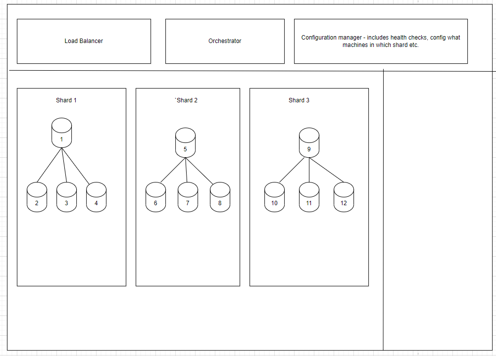
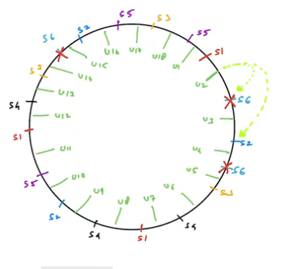

# Orchestration and Shard Creation

## How do we manage a sharded NoSQL database?

SQL databases provide a fixed schema, normalization and ACID guarantees.
But as soon as we shard the database, ACID guarantees are thrown out of the window.
SQL database does not support sharding by default.

> NoSQL databases are auto sharded.

1. How to handle various machines??
* How to add/remove machines?
* Which machines are assigned to which shard? (shard is single point of data then why multiple machines in a shard - for replication)
* Ensure a replication factor is maintained—how many minimum replicas must each data have?

2. How do we create and remove shards?
* Ensure even load distribution across shards

Someone has to automatically handle all the above pointers mentioned—we have a database orchestrator.

We will create a dedicated machine and call this database orchestrator, this machine will handle all the above.

In sharded database, we need to figure out which request to send to which server - consistent hashing does that in an elegant manner.

All servers are assigned multiple positions in the circle and data is stored to servers.

Adding Replication to Consistent Hashing:
1. Master-Slave - one shard consists of multiple servers. When we use master-slave replication inside each shard (collection of servers), our shards cannot crash. A server in shard can crash but shard all together cannot crash.
2. Multi-Master

We can no longer have servers on the ring, instead we place shards on the ring.

## Orchestrator

Multiple machines - N 

Replication factor - X, Each shard gets X machines

Multiple shards - K



In above case N = 12, K = 3, X = 4

1. A machine inside a shard can crash.
2. We might add new machines
3. we might remove machines

How should orchestrator manage above scenarios?

### When we add new machines (M)?

Suppose we bought nine new machines.
What possibly we can do:
1. Increase the replication factor—Not needed; user decided X is good enough for their use case
2. Create more shards so that the load on all shards is reduced. How many new shards can we create? The Answer is M/X (9/4 = 2)
3. If we have extra machines leftover but not enough to create shards, we can leave them idle

`Issue` - What happens if a machine in shard crashes.

In case in shard 1–1 machine fails, and also at same time in shard 2, one machine fails—how to manage? We have only one idle machine as of now.

> We need to ensure we have enough replacement/stand by machines (R). 

In this case our number of possible shards becomes (M-R)/X

### What happens if a machine in existing shard crashes?

1. A replacement machine immediately replaces this crashed machine - How does the data copy happen?
2. The crashed machine is sent for repair 
3. Once fixed, it is added back to the idle poll.

`Issue` - We still have idle machines with which we cannot create shards plus these are expensive machines put to no use.

> Put idle machines to work
> 
> We cannot create a new shard—if we do, we won't have sufficient replacements.
> 
> We can use these machines as extra replicas in existing shards with a caveat that they can be snatched away from the shard if they are needed by another shard.


**What are the benefits of this?** 

Since in shards we already have extra machines, we won't need to replace the machines even if a machine is not working. 

**How to calculate the number of replacement machines?**

Based on past performance/ vendor's hardware specs find avg # of days after which a machine crashes
Find the time needed to replace/buy a new one

Probability that at any given moment a specific machine is down (P)?

Every 2 years the machine is down for 1 day. (1/2 * 365) .

Given we have K shards and X replication factor, we have N = K*X machines (K = 1000, X = 4)

Expected number of machines which are down on any given day = N * Probability = 4000 * (1/2*365) = 5.47

So approx 6 replacement machines we need meaning on hald of the days we will have fewer crashes and other half more crashes.

Find out the number of R such that 
Probability (# of crashed machines <= R) >= 99.9%

We can use standard deviations R = N * P + 3 sigma

### Shard Creation—What happens when we create a shard?

When orchestrator decides to create a new shard, we need to move data to this shard.
How does ot happen?

There is an algorithm for seamless shard creation, and it works in 2 phases:
1. `Staging phase` - 
* Orchestrator has decided to create a new shard. So far, no other machines (load balancer/ config manager etc.) knows about this.
* Perform simulation using consistent hashing ring—from which shard data needs to be moved based on the positions decided for the new shards
* Orchestrator assigns machines for new shard and starts copying data.
* Between t0 (start time) - t1(data copy finishes) where the requests of data to be moved going? - Old shard, why? - LB has no idea. During this time if any writes were made, they will not be present in new shard.

2. `Real phase` -
* Start copying the delta to new shard
* Announce to all layers (load balancer, config manager) that new shard is live
There is inconsistency, delta is not yet in new shard it is being copied.
* In real phase if any requests come to new shard, we have a consistency issue. If we are following immediate consistency—we can deny the request, for eventual we can serve requets.
* This phase only takes a few seconds, we hvae reduced system unavailability from 30 mins to a few seconds.  

`Live phase` After delta is copied all operations resume.

### Multi Master
Get rid of the concept of shards
* every user is a distinct entity
* servers have multiple users
* there is no master or slave 
* each server serves both read and write request 
* We still have replication

replication factor X = 3
 
servers N = 6



```
server {primary}, {replica 1}, {replica 2}

s1 {u1, u7, u11}, {u6, u10, u18}, {u5, u9, }
s2 {u3, u9, u15}, {u2, u8, u14}, {u1, u7}
s3 {u5, u13, u17}, {u4, u12, u16}, {u2, u3}
s4 {u6, u8, u12}, {u5, u9, u11}, {u4, u6, }
s5 {u10, u16, u18}, {u9, u15, u14}, {u8, }
s6 {u2, u4, u14}, {u1, u3, u13}, {}
```

## Tunable Consistency

In case of master slave - CAP theorem 

**Data Loss:**

| Operation | Where happens | Availability | Consistency | Latency|
|-----------|---------------|--------------|-------------|--------|
| Read      | any slave     | Very high    | data loss   | very low|
| Write     | master        | Very high    | data loss   | very low|


**Eventual consistency:**

| Operation | Where happens    | Availability | Consistency | Latency  |
|-----------|------------------|--------------|-------------|----------|
| Read      | any slave        | Very high    | eventual    | very low |
| Write     | master + 1 slave | High         | eventual   | okay     |

**Immediate Consistency:**

| Operation | Where happens                     | Availability | Consistency | Latency|
|-----------|-----------------------------------|--------------|-------------|--------|
| Read      | any slave                         | Very high    | Immediate    | very low|
| Write     | all places (masters + all slaves) | very low     | Immediate   | very very high|

**Quorum:**

| Operation | Where happens              | Availability | Consistency | Latency |
|-----------|----------------------------|--------------|-------------|---------|
| Read      | (n+1)/2   [more than half] | low          | consistent  | high    |
| Write     | (n+1)/2                    | low          | consistent  | high    |

Since we are writing to more than half of servers, there always exists an overlap.
At least one server read from has the latest data.
Reading uses the latest data - every write is timestamped

```
R - number of servers you must successfully read from for a read request to be successful

W - number of servers you must successfully write to for request to be successful

X - replication factor

R  = X+1/2, W = X+1/2

R+W = X+1

R+W > X (indicates at least one overlap) and can support immediate consistency

R+w < X -> eventual consistency

W = 1 -> data loss

W > 1 -> No data loss
```

**In master slave what happens when a master dies?**

`Case - During write master crashes`:
* master fails to respond
* no response will be recorded by client/app server
* request will time out and retry should happen
* No data loss happens

`Case - Wrote happens successfully, but immediately after this the master crashes`
* Write happened at master only - data loss
* Write happened at 2 places - no data loss